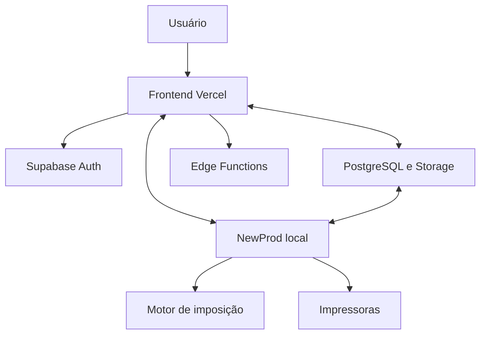

# Arquitetura atual

Este documento descreve a arquitetura pretendida do Ideal Imposition na branch `main`. A configuração efetiva da Vercel, do Supabase e das estações deve ser conferida quando a pergunta envolver o que está realmente publicado.

## Visão geral

## Componentes

### Frontend web

O painel é uma aplicação HTML, CSS e JavaScript publicada pela Vercel. O domínio principal confirmado para o projeto é [ideal-imposition.vercel.app](https://ideal-imposition.vercel.app).

O frontend:

- apresenta os fluxos de produção;
- autentica sessões pelo Supabase Auth;
- consulta dados permitidos pelo Supabase;
- chama Edge Functions nas operações de nuvem protegidas;
- usa o motor local quando a operação exige imposição ou impressão na estação.

O nome do projeto Vercel e o nome do repositório GitHub não precisam ser iguais.

### Supabase

O Supabase oferece:

- autenticação e renovação de sessões;
- banco PostgreSQL;
- Storage;
- Edge Functions;
- filas e dados usados na sincronização das estações.

A interface de login é própria do Ideal Imposition. A autenticação da identidade é feita pelo Supabase Auth; a aplicação complementa essa identidade com papéis, permissões e elevações internas.

Não documentar o estado atual de RLS somente a partir de um arquivo SQL. Scripts no repositório mostram intenção ou histórico; as políticas realmente aplicadas devem ser verificadas no projeto Supabase.

### Edge Functions

As Edge Functions são o backend na nuvem. Elas concentram operações que exigem validação no servidor, acesso protegido ou uso de segredos que não podem ser expostos no navegador ou na estação.

Os segredos da nuvem pertencem ao ambiente protegido do Supabase. A chave
`service_role` nunca deve ser gravada no frontend, incorporada no NewProd nem
versionada.

A estação usa um canal de autenticação diferente: o build atual incorpora um
segredo específico do agente para autenticar a comunicação da estação. Essa
credencial não é a `service_role`; ainda assim, deve ser tratada como material
restrito, com finalidade limitada, rotação controlada e sem exposição no
frontend ou em logs.

### NewProd

O NewProd é obrigatório para imposição e impressão na estação da gráfica.

O inicializador `agent_tray.py` carrega a aplicação definida em `app.py` e inicia o servidor em `127.0.0.1:9000`. Nesse modo, o serviço aceita conexões apenas da própria máquina.

Responsabilidades principais:

| Arquivo | Responsabilidade |
|---|---|
| `agent_tray.py` | Inicialização, bandeja, atualização e abertura do painel |
| `app.py` | API FastAPI local usada pelo NewProd |
| `engine.py` | Montagem e imposição dos PDFs |
| `print_service.py` | Envio para o spooler e impressoras |
| `agent_worker.py` | Fila, heartbeat, sincronização e atualização |
| `security_config.py` | Configuração central de segurança do agente |

A execução direta de `app.py` é um modo técnico diferente e pode usar configuração de host distinta. Ela não deve ser descrita como o comportamento do executável instalado.

`local_print_agent.py` permanece no repositório, mas não é equivalente ao caminho principal do NewProd. Qualquer uso atual desse arquivo deve ser documentado separadamente.

### Modo local e offline

O modo local/offline deve ser descrito como fluxo próprio:

- o painel pode ser servido pela estação;
- o motor continua local;
- dados locais podem ser usados quando o fluxo assim permitir;
- autenticação online e autorização offline não devem ser apresentadas como o mesmo mecanismo;
- uma operação que dependa da nuvem deve informar claramente quando não estiver disponível.

## Fluxos principais

### Login

1. O usuário acessa a interface própria.
2. O frontend autentica as credenciais pelo Supabase Auth.
3. A sessão fornece o token de identidade.
4. A aplicação consulta e aplica permissões complementares.
5. Operações sensíveis podem exigir elevação adicional.

### Imposição

1. O painel prepara a configuração e os arquivos.
2. O trabalho chega ao NewProd na estação.
3. `app.py` coordena a requisição.
4. `engine.py` gera o PDF.
5. O resultado volta ao operador ou segue para impressão.

A imposição não é executada no Render nem em outro backend Python público.

### Impressão

1. O painel seleciona trabalho, opções e impressora.
2. O NewProd recebe o trabalho localmente.
3. `print_service.py` conversa com o spooler do Windows.
4. O agente acompanha o resultado e sincroniza o estado necessário.

### Fila e sincronização

`agent_worker.py` mantém a identidade da estação, heartbeat, fila de trabalhos, sincronizações e atualizações. O agente usa a credencial específica de estação prevista para esse canal. Segredos administrativos, especialmente a `service_role`, permanecem exclusivamente nas Edge Functions.

## Implantação e versões

Existem estados diferentes que não devem ser misturados:

| Estado | Fonte adequada |
|---|---|
| Versão declarada no código | `agent_version.py` e arquivos de build correspondentes |
| Versão instalada | estação Windows |
| Versão publicada para atualização | manifesto e Storage de releases |
| Versão do frontend | implantação efetiva da Vercel |
| Código principal | commit da branch `main` |

`STATUS_PROJETO.md` é um registro útil, mas não comprova sozinho nenhuma dessas versões.

## Componentes legados

Referências a Firebase, Firestore e Render podem permanecer por histórico, migração ou compatibilidade. Elas não fazem parte da arquitetura ativa, salvo quando um ponto específico do código declarar explicitamente uma compatibilidade ainda necessária.

Antes de remover qualquer componente legado:

1. localizar todas as referências;
2. identificar dependências de dados ou compatibilidade;
3. executar testes;
4. remover em tarefa separada;
5. registrar a decisão no changelog.

## Hierarquia de evidências

Quando houver divergência:

1. configuração do ambiente confirma o que está efetivamente publicado;
2. código da branch `main` define o comportamento implementado;
3. este documento descreve a arquitetura pretendida;
4. documentos de status e sessão registram contexto histórico, não prova operacional.

Toda divergência deve ser investigada e corrigida; nenhuma dessas fontes deve ser silenciosamente tratada como substituta das demais.
