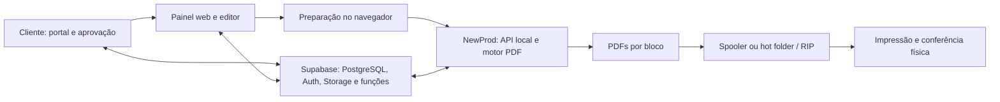
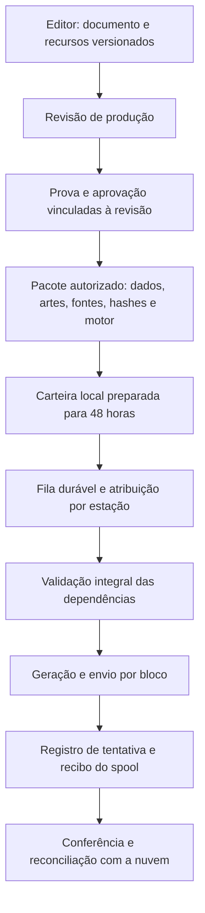

# Avaliação crítica da arquitetura da gráfica online

## Escopo e conclusão

Análise de código em `df13d5de`, painel v958 / NewProd 1.2.339, em 24/09/2026. Premissas informadas: seis estações simultâneas, trabalhos habituais de até 2.000 páginas e continuidade por dois dias sem internet. O usuário confirmou que a operação offline se limita aos pedidos previamente aprovados e totalmente preparados, ciente de que alterações/cancelamentos online não chegam durante a queda. Tamanho dos arquivos, hardware, volume diário e tempo máximo de recuperação ainda não informados.

Foram inspecionados frontend, editor, portal, preparação de impressão, motor, fila, atualizador, SQL versionado e documentação. Não houve consulta nova ao banco compartilhado, auditoria das permissões efetivas, benchmark de carga, alteração funcional ou impressão física. Os achados de código demonstram mecanismos e riscos; não provam que todos tenham ocorrido em pedidos reais.

**A arquitetura híbrida é adequada ao negócio. O grau atual de consistência, persistência e autonomia operacional ainda não sustenta uma garantia de produção por 48 horas sem internet.** A evolução prioritária é criar uma revisão de produção imutável, aprovada e executável localmente, com registro durável de cada bloco. Preservar Supabase e o motor local; evoluir por etapas.

## Estrutura observada

Os binários de arte ficam principalmente no Storage, com referências e metadados no PostgreSQL. Também existem campos com base64/JSON, caches locais e configuração de estação. Há múltiplos caminhos: comunicação local direta, fila remota e download de PDF.

## Acertos a preservar

| Decisão | Benefício | Custo / limite |
|---|---|---|
| Nuvem para atendimento, aprovação e dados | Centralização e acesso remoto; menos circulação manual de arquivos | Dependência de rede e disciplina de autorização/versionamento |
| Imposição nas estações | CPU distribuída; acesso direto a Windows, impressoras e RIP | Diferenças de hardware, fontes, drivers, perfis e versões |
| Supabase/PostgreSQL/Storage | Transações relacionais, autenticação e armazenamento integrados | Transação do banco não torna arquivos externos automaticamente atômicos |
| PDF vetorial no motor onde aplicável | Preservação de qualidade e melhor tamanho que rasterizar tudo | Editor e rotas de impressão podem rasterizar em outros pontos |
| Blocos, limite de avanço do stream e temporários por trabalho | Reduzem pico de memória e espera inicial | Não substituem fila persistente nem recuperação após queda |
| Reivindicação condicional de trabalhos remotos | Evita dois consumidores assumirem a mesma linha pendente | Não elimina duplicidade de trabalhos diferentes nem ambiguidade após spool |
| Protocolo de integridade v1 | Valida arquivos, sequência, dados obrigatórios e falhas antes/depois do envio | Não equivale a aprovação versionada, autorização criptográfica ou prova física |
| Testes sintéticos, harnesses de navegador e hashes de release | Boa base de regressão e rastreabilidade de entrega | Ainda exige testes de carga, falhas e aceitação da estação |

## Achados e consequências

### 1. Salvamento pode ampliar o alvo para todos os modelos do pedido — prioridade imediata

Em `frontend/script.js:37122`, se tentativas de localizar o modelo não atualizam linhas, existe fallback de `pedidos_modelos.update(dbData).eq('id_int', osNum)`. A condição de proteção considera somente alterações com `status_arte` ou `status_impressao` (`:37032`). Arte e outras configurações, sem esses campos, podem chegar ao filtro amplo.

**Mecanismo confirmado no código; ocorrência real não verificada.** Se ativado e permitido pelo banco, pode aplicar os mesmos dados a vários modelos. A tentativa por pedido + ordem também precisa de unicidade efetiva. Isso merece precedência sobre melhorias estéticas ou troca de framework.

Direção: uma gravação de modelo deve exigir identificador inequívoco e exatamente uma linha confirmada, incluindo os valores persistidos. Falha de identificação deve parar e pedir recarga; criação de modelo deve ser uma operação explícita e separada. Provar com regressão de pedido sintético com dois modelos.

### 2. A estrutura editável não tem persistência central no fluxo examinado — prioridade alta

`frontend/criador-arte.js:1399` grava o JSON do Fabric em `localStorage`. O salvamento compartilhado remove `arte_json` e `verso_arte_json` do payload (`frontend/script.js:37001`). O PDF é persistido, mas isso não preserva as camadas editáveis em outro computador.

Consequência: reabrir o PDF é possível; recuperar textos e objetos como estavam no editor pode depender daquele navegador/perfil. Limpeza do navegador ou troca de estação pode perder editabilidade, sem necessariamente perder a arte final.

Direção: documento editável versionado no Storage, com schema e referências aos recursos; registro no banco para revisão, autor, hash e derivado de impressão. `localStorage` pode guardar rascunhos recuperáveis, sem ser a única cópia do original editável.

### 3. O editor transforma a composição em imagem dentro de PDF — prioridade alta para qualidade

Em `frontend/criador-arte.js:1421`, a exportação usa PNG e `embedPng` em PDF. Portanto, a extensão PDF não implica conteúdo vetorial. A escala nominal de quatro pixels/mm e multiplicador dois corresponde a aproximadamente 203 dpi, antes de efeitos de zoom/transformação; a resolução efetiva deve ser medida no artefato.

Isso pode prejudicar texto pequeno, linhas finas e códigos inseridos na arte. Não se aplica automaticamente à numeração gerada pelo motor nem a todo PDF enviado pelo cliente. O motor tem caminhos vetoriais, e há gestão ICC em `color_profiles.py`.

Outro defeito concreto: o erro de geração/upload é capturado, a rotina mantém PNG como alternativa e pode continuar até a mensagem de sucesso “PDF salvo”. Sucesso precisa corresponder ao formato e à persistência realmente confirmados.

Direção: exportação vetorial quando suportada; raster com resolução física explícita onde necessário; pré-validação de tamanho, fontes, margens/sangria, transparência, perfil de cor e códigos. Não declarar conformidade PDF/X apenas porque existe PDF ou OutputIntent.

### 4. Aprovação não está vinculada a uma revisão imutável no caminho examinado — prioridade alta

`frontend/cliente.js:158` confirma persistência do status por modelo/pedido, mas não envia uma revisão esperada da arte/banco nem seu hash. `sql/link_cliente_finalizar.sql` contém boas verificações transacionais de estado e confirmação, porém não constitui um pacote imutável completo de produção. O SQL local não prova sua implantação atual.

Risco: o cliente vê uma composição e confirma um estado enquanto arte, banco ou catálogo podem sofrer mudanças concorrentes. A v958 relê dados e detecta diversas divergências, mas não cria identidade de revisão entre a amostra aprovada e o material impresso.

Direção: aprovação ligada a `revision_id`, hashes das duas faces, dados variáveis, fontes e regras relevantes. Qualquer alteração material cria nova revisão; a revisão antiga permanece auditável. A geração referencia exatamente a revisão liberada.

### 5. Motor local não entrega, por si só, 48 horas de autonomia — lacuna de requisito

`frontend/arte-de-impressao.js:168` consulta modelos, catálogos e bancos e baixa artes antes de gerar. Sem internet, pedidos que dependem dessas consultas não podem ser confirmados. Esse bloqueio é correto para dados desconhecidos, mas impede a autonomia solicitada.

O painel ainda referencia bibliotecas de CDNs; o service worker em `frontend/sw.js` atende o Ideal Control, não demonstra cobertura offline do painel de impressão. Abrir uma aba já aquecida não é teste suficiente.

Direção: baixar antecipadamente uma carteira de trabalho de 48 horas, com dependências completas e autorização de execução verificável localmente. Empacotar bibliotecas, fontes e perfis necessários; fila local durável e reinicialização testada sem rede. Conservar geração/envio por bloco após validar todo o pacote, conforme decisão operacional anterior.

**Limite inevitável e aceito pelo usuário:** durante a queda, a estação não sabe de cancelamentos ou alterações feitos na nuvem. A política autorizada é continuar somente com os pedidos previamente aprovados e preparados. Formalizar a validade de execução de cada revisão por 48 horas e sua atribuição. Pedidos nunca baixados/aprovados permanecem bloqueados; criação/edição offline não integra esta proposta.

### 6. Fila remota protege a disputa inicial, mas não fecha a recuperação — prioridade alta

`agent_worker.py:358` reivindica com `status=eq.pending`, um acerto. Depois envia ao spooler/hot folder e grava `completed`. Se o processo ou a rede falhar nesse intervalo, o efeito físico e o estado remoto podem divergir. O caminho examinado não oferece recibo durável completo por bloco e tentativa que resolva esse intervalo.

`print_service.py` confirma envio; não confirma que cada página saiu corretamente. Reinserir um trabalho com novo ID também não é evitado apenas pela reivindicação atômica de outra linha.

Direção: identificar revisão, bloco, faixa e tentativa; registrar localmente antes/depois do envio, preservar identificador do spool quando disponível e distinguir preparado, aceito pelo spool, interrompido e conferido. Situação incerta exige retomada explícita. Não prometer exatamente uma impressão física sob qualquer falha.

Com seis estações offline, atribuir cada trabalho/bloco a uma estação ou coordenar pela LAN. Reatribuição deve impedir execução simultânea do original, especialmente se uma estação estiver isolada. Um prazo vencido sozinho não prova que o bloco não foi impresso.

### 7. Atualização pode interferir com processamento local — prioridade alta

`agent_worker.py:925` baixa/valida MSI e dispara encerramento/reinício. Não foi encontrada nessa rotina uma barreira que aguarde as tarefas de imposição de `app.py`. Embora a fila do worker rode sequencialmente, as imposições HTTP podem rodar em paralelo.

`agent_worker.py:712` troca os arquivos do painel individualmente após baixá-los: cada troca é atômica, mas o conjunto inteiro não é uma única revisão servida. Há risco de uma abertura durante a transição observar combinação de arquivos.

Direção: atualização em estado ocioso, pausa de admissões, checkpoint de trabalhos, ativação atômica do pacote de painel e matriz de compatibilidade. Piloto em uma estação antes de ampliar para as outras cinco. Hash do MSI protege integridade; assinatura verificada com chave pública independente acrescentaria autenticação do release contra comprometimento do bucket/manifesto.

### 8. Navegador concentra responsabilidades críticas demais — prioridade estrutural

`frontend/script.js` concentra estado global, catálogo, regras, persistência, preparação e impressão, com dezenas de milhares de linhas. Pedido, cliente e Montagem têm grandes implementações próprias. Existem múltiplos renderizadores de prévia e aliases de campos, além de valores distintos de status.

Consequência: o resultado pode depender da tela de entrada, sequência de awaits, cache e normalização. Esse desenho ajuda a entregar funcionalidades rapidamente, mas eleva o custo de provar consistência em seis estações.

Direção: extrair contratos e operações de domínio gradualmente: revisão da arte, aprovação, pacote de produção e execução. Backend controla operações críticas; UI apresenta estado e solicita comandos. Framework novo não é pré-requisito. Usar um contrato de composição comum e provas produzidas pelo mesmo motor quando viável.

### 9. Segurança precisa de prova por caminho, não só de login — prioridade de auditoria

Há boas rotas autenticadas nas Edge Functions e RPCs que validam pedido/token. Entretanto, a aprovação de modelo examinada usa `update` direto em tabela sem incluir o token do link nessa operação. Isso exige conferir como a autorização é realmente imposta no banco. Validação JavaScript não protege chamadas feitas fora da tela.

O relay de `agent_worker.py:78` usa `db.SUPABASE_KEY`; ele não é o mesmo canal de autenticação do segredo de publicação QR. Identidade, permissões e revogação devem ser verificadas por canal/estação. Não expor `service_role` no agente ou navegador.

A documentação histórica de RLS orienta a auditoria, mas não confirma permissões atuais. Revisar grants, RLS, views, RPCs SECURITY DEFINER, Storage e integração ERP em leitura autorizada específica, sem revogar acessos por hipótese. Separar banco variável com dados pessoais de arquivos destinados a acesso público.

### 10. Backup do banco não basta para preservar a produção — prioridade de continuidade

Não foi verificado um procedimento operacional completo de restauração de banco + objetos de arte + fontes + configurações locais. Ausência de evidência aqui não prova ausência de backup.

A documentação oficial informa que backups do PostgreSQL do Supabase não incluem os objetos do Storage. Portanto, restauração somente do banco pode devolver referências a arquivos que continuam ausentes.

Direção: backup independente de objetos e metadados relacionados, retenção de revisões, configurações das estações e testes de restauração de pedidos reais em ambiente isolado. Definir perda máxima de dados tolerada e tempo de recuperação. Cache offline de 48 horas e backup são controles diferentes.

### 11. Capacidade e reprodutibilidade ainda precisam ser medidas

Seis estações não justificam, por si só, reescrever tudo em microsserviços. A carga depende da área física das páginas, resolução, fotos, transparências, fontes, caminhos RAW/GDI/RIP e simultaneidade. Duas mil páginas simples e duas mil páginas com fotos são cargas distintas.

O envio SSE com base64 aumenta bytes em aproximadamente um terço, além das cópias em memória. O limite de avanço ajuda por trabalho, mas não é um limite global de recursos para todas as abas/jobs. Fechar a aba também não interrompe imediatamente todo processamento do motor no caminho atual.

Direção: medir pico de RAM/disco, tempo de preparação e primeiro bloco, páginas/minuto, tráfego e tempo de retomada. Para limitar recursos, considerar fila por estação e referências a arquivos locais protegidos em vez de transportar todo PDF em base64 através do navegador. Dimensionar disco pela carteira de 48 horas e intermediários, não apenas pelo número de páginas.

`requirements.txt` usa limites inferiores de versões; o frontend inclui Supabase JS por versão major. O build real foi conferido, mas reconstruir a mesma fonte no futuro não fica completamente determinado por essas declarações. Adotar ambiente de release reproduzível e inventário de bibliotecas; não atualizar dependências incidentalmente.

## Arquitetura proposta para evolução

Manter edição, comercial e aprovação na nuvem. Gerar um pacote consistente a partir de uma revisão fechada, com recursos imutáveis: uma transação de banco isoladamente não congela URLs mutáveis do Storage. O manifesto deve distinguir arte ausente por decisão de arquivo ainda não carregado e preservar frente só numeração/verso com arte.

Preferência inicial: cache e registro durável em cada estação, com atribuição explícita. Um coordenador/cache na LAN pode reduzir downloads e melhorar distribuição; só acrescentá-lo com disponibilidade e recuperação definidas, pois vira outro ponto de dependência. Não há necessidade demonstrada de mover toda a renderização para a nuvem.

## Ordem recomendada

1. **Contenção:** retirar gravações de modelo com filtro amplo; confirmar salvamento real do editor; auditar autorização de aprovação/fila/Storage; impedir atualização no meio de produção.
2. **Consistência:** documento editável central, revisão imutável, aprovação vinculada, prova derivada da mesma revisão e pacote de produção completo.
3. **Continuidade:** carteira de 48 horas, fila/registro local, atribuição entre estações, reinício sem rede e reconciliação sem reenvio automático de blocos incertos.
4. **Qualidade e capacidade:** pré-validação gráfica, testes das cargas de 2.000 páginas e matriz por impressora/RIP.
5. **Manutenção:** modularização gradual, versões reproduzíveis, telemetria por trabalho e documentação alinhada à implantação. `docs/ARQUITETURA.md` ainda descreve Vercel onde a entrega atual confirmou Cloudflare.

## Critérios para considerar a evolução aceita

- Modelo errado/ausente nunca amplia o filtro de escrita; atualização retorna exatamente a revisão esperada.
- Aprovação de revisão antiga não libera revisão nova; alteração exige fluxo definido de nova aprovação.
- Falha ao baixar qualquer dependência impede o primeiro bloco; ausência intencional de arte/numeração permanece legal.
- Seis estações executam cargas representativas sem troca de dados entre trabalhos e com recursos limitados.
- Queda de internet por 48 horas, fechamento do navegador e reinício do Windows preservam trabalhos preparados; pedido não preparado permanece bloqueado.
- Queda após envio ao spool marca situação incerta e exige decisão explícita, sem reimpressão automática.
- Atualização aguarda o momento seguro; estação antiga incompatível fica bloqueada de forma compreensível.
- Restauração isolada recupera revisão aprovada, arquivos, dados e configuração suficiente para reconstruir a produção.

## Referências externas verificadas

- [Supabase — backups](https://supabase.com/docs/guides/platform/backups): diferença entre backup de banco e objetos do Storage.
- [Supabase — RLS](https://supabase.com/docs/guides/database/postgres/row-level-security): proteção de acesso e bypass por service role.
- [PostgreSQL — isolamento](https://www.postgresql.org/docs/current/transaction-iso.html): leituras sucessivas e consistência transacional. A versão instalada do projeto não foi consultada nesta análise.

Esta avaliação é um plano de evolução e uma revisão crítica. Não executa correções, migrações, alteração de permissões ou nova publicação.
