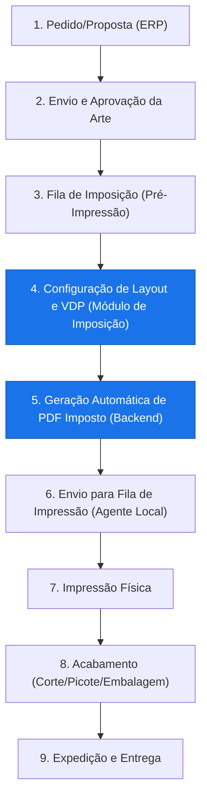
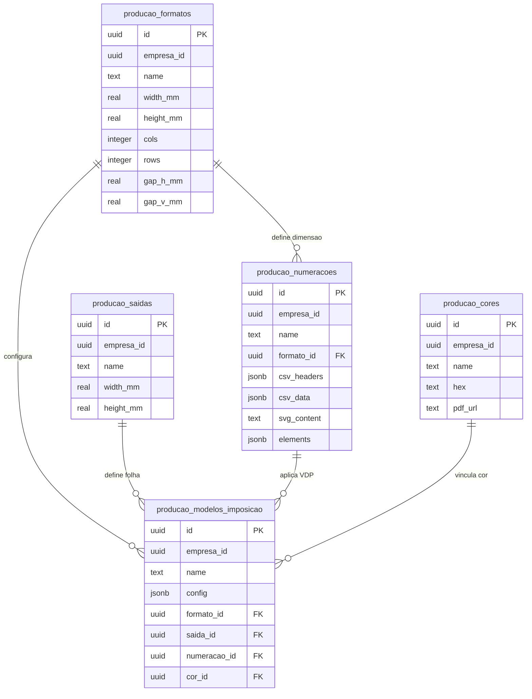

# Documento Técnico: Arquitetura Funcional e Modelagem Conceitual (UUID & empresa_id)
## Módulo de Imposição Gráfica & VDP (Dados Variáveis)

Este documento apresenta a especificação técnica detalhada do módulo de **Imposição Gráfica e Dados Variáveis (VDP)** integrado ao ecossistema de Produção do ERP Ideal (desenvolvido pelo parceiro **Vibecode**).

O objetivo é expor com transparência os objetivos funcionais, o fluxo operacional, o relacionamento com as entidades do ERP e a modelagem lógica proposta para o banco de dados Supabase antes de qualquer alteração física ou criação de tabelas, em conformidade com as regras de **UUID como PK** e **empresa_id**.

---

### 1. Objetivo do Módulo

*   **Qual problema operacional o módulo resolve?**
    A montagem manual de folhas de impressão com múltiplas poses (imposição) e a aplicação de dados variáveis (como numeração sequencial, QR Codes de controle de acesso, códigos de barras e nomes de convidados) é um gargalo de tempo crítico. Além de ser lenta, a execução manual é propensa a erros catastróficos, como duplicidade de ingressos, desalinhamento de corte na guilhotina e inversão de verso e frente. O módulo automatiza esse processo em segundos, gerando PDFs prontos para impressão.
*   **Qual processo da produção ele atende?**
    Atende à **Pré-impressão** (planejamento físico do papel de saída e aproveitamento de grade) e à **Geração de Dados Variáveis (VDP)**.
*   **Quem utilizará o módulo?**
    Operadores de Pré-impressão, Arte-Finalistas e Operadores de Impressão Digital/Offset.
*   **Em qual etapa do fluxo produtivo ele entra?**
    Ele entra na transição da etapa de **Criação/Aprovação de Arte** para a etapa de **Impressão Física**.

---

### 2. Fluxo Operacional Completo

Abaixo está o fluxo ponta a ponta que ilustra a inserção do módulo de Imposição no fluxo produtivo:

*   **Onde o Módulo Entra:** Ele atua ativamente nas etapas **4 (Configuração de Layout e VDP)** e **5 (Geração Automática de PDF Imposto)**. Ele consome dados das etapas anteriores (quantidade, dados do cliente e arquivo base da arte) e fornece o arquivo otimizado para as etapas seguintes.

---

### 3. Relação com o ERP (Entidades do Vibecode)

O módulo de Imposição é acoplado de forma não invasiva ao banco do ERP. Ele realiza apenas leituras nas tabelas proprietárias do Vibecode, garantindo a integridade dos dados existentes.

| Entidade do ERP | Obrigatoriedade | Cardinalidade | Finalidade na Imposição |
| :--- | :--- | :--- | :--- |
| **`propostas`** | Opcional | `1 : N` | Associa lotes de imposição à proposta comercial de origem para rastreabilidade de vendas. (Relacionamento por `id_int`). |
| **`produtos_proposta`** | Obrigatória | `1 : 1` | Obtém a especificação física do item (descrição, dimensões estimadas) e a quantidade exata a ser impressa (`qtd`). |
| **`produtos`** | Opcional | `N : 1` | Permite associar o modelo de layout padrão do produto físico cadastrado para automatizar o setup geométrico. (Relacionamento por `id_produto`). |
| **`clientes`** | Opcional | `N : 1` | Fornece dados cadastrais básicos (Nome/Razão Social) para exibição em tarjas de controle impressas nas margens de descarte das folhas. |
| **`pedidos`** | Futura | `1 : 1` | Quando o módulo de pedidos do ERP estiver totalmente operacional, substituirá a associação de propostas para vincular diretamente ao pedido faturado. |
| **`arquivos / artes`** | Obrigatória | `1 : 1` | Caminho do arquivo base do cliente (PDF/PNG/JPG da arte) que será multiplicado e personalizado com VDP. |

---

### 4. Modelagem Conceitual das Entidades do Módulo (UUID e empresa_id)

O módulo gerencia os parâmetros geométricos e regras de layout através de cinco tabelas dedicadas. Elas não interferem no ERP, seguem o prefixo `producao_`, usam chaves primárias do tipo `UUID` e incluem `empresa_id` para governança de dados:

---

### 5. Justificativa das Tabelas

1.  **`producao_formatos`**
    *   **Finalidade:** Armazena o gabarito de corte individual e o layout da grade de poses.
    *   **Motivo da existência:** Evita que o operador precise calcular manualmente o número de colunas/linhas e gaps (espaçamentos) de corte a cada trabalho.
    *   **Quem utiliza:** Operador de pré-impressão.
    *   **Ciclo de vida:** Criada no cadastro de um novo tipo de produto físico. Não expira, a menos que o produto seja descontinuado comercialmente.
2.  **`producao_saidas`**
    *   **Finalidade:** Armazena as dimensões das folhas de papel físicas utilizadas pelas impressoras (ex: SRA3, A3, A4).
    *   **Motivo da existência:** Permite ao algoritmo validar instantaneamente se a grade do formato cabe na folha de impressão selecionada, evitando erros de sangria e corte.
    *   **Quem utiliza:** Operador de pré-impressão e gerente de suprimentos.
    *   **Ciclo de vida:** Registros estáticos. Apenas sofre alterações na compra de novas impressoras ou mudança de fornecedor de papel.
3.  **`producao_numeracoes`**
    *   **Finalidade:** Guarda a "receita" do VDP: posição (x,y), tamanho, fonte e tipo dos elementos variáveis (QR code, código de barras, textos).
    *   **Motivo da existência:** Permite reutilizar as regras de numeração em propostas diferentes sem precisar reconfigurar os campos VDP no canvas toda vez.
    *   **Quem utiliza:** Arte-finalista e operador.
    *   **Ciclo de vida:** Vinculada à criação de novas regras de segurança para ingressos. Atualizada se o design de segurança do ingresso mudar.
4.  **`producao_cores`**
    *   **Finalidade:** Vincula o cadastro de cores especiais a um arquivo PDF estático vetorial de referência.
    *   **Motivo da existência:** Garante a calibração de cor exata entre a aprovação do cliente e a impressão digital da fábrica.
    *   **Quem utiliza:** Impressor e Arte-finalista.
    *   **Ciclo de vida:** Editado quando há ajustes de lote de tinta ou calibração de cor do maquinário.
5.  **`producao_modelos_imposicao`**
    *   **Finalidade:** Consolida a combinação (Formatos + Saídas + Numerações + Cores) sob um nome descritivo (ex: "Modelo Ingresso VIP SRA3 Duplex").
    *   **Motivo da existência:** Agilidade. Reduz o tempo de setup da imposição de 15 minutos para 1 único clique do operador de pré-impressão.
    *   **Quem utiliza:** Operadores de imposição.
    *   **Ciclo de vida:** Salvo sob demanda e atualizado conforme novas otimizações gráficas.

---

### 6. Estratégia de Armazenamento de Arquivos

Para manter o banco de dados leve e com excelente tempo de resposta, arquivos binários pesados **nunca** serão gravados no banco de dados.

*   **Tabelas SQL (Banco):** Armazenam apenas metadados, configurações numéricas (mm/pontos), parâmetros JSONB dos elementos VDP e URLs de referência de arquivos.
*   **Storage (Supabase Buckets):**
    *   *PDFs de Referência de Cor:* Armazenados permanentemente em bucket privado (tamanho médio: 200KB a 2MB por arquivo).
    *   *PDFs Finais Impostos (Gargalo de Armazenamento):* Arquivos resultantes com centenas de páginas gerados pelo motor Python. Serão salvos temporariamente em um bucket específico no Storage.
    *   *Política de Retenção (Garbage Collection):* Implementação de uma política de expiração automática (TTL) para deletar os PDFs de saída finais do Storage após **7 dias**. Apenas o link é exibido temporariamente para download do operador no momento da imposição.
    *   *SVGs e Logotipos:* Elementos vetoriais simples de numeração serão armazenados diretamente como strings de texto XML na coluna `svg_content` da tabela `producao_numeracoes`, reduzindo chamadas adicionais de rede.
    *   *CSVs de Dados:* O arquivo CSV enviado pelo cliente é lido em memória pelo backend, processado no motor de PDF e descartado imediatamente. Se o lote for salvo, os dados tratados são registrados na coluna `csv_data` (formato JSONB).

---

### 7. Estrutura de Segurança e Desempenho no Banco de Dados

*   **RLS (Row Level Security):**
    *   *Status Proposto:* Habilitado em todas as tabelas `producao_*`.
    *   *Justificativa:* Protege as configurações operacionais contra acessos externos baseados no `empresa_id` logado no JWT.
*   **Triggers:**
    *   *Status Proposto:* Habilitado.
    *   *Função:* Trigger `trg_producao_..._updated` associado a todas as tabelas operacionais. Ele executará a função nativa `producao_update_updated_at()`, registrando automaticamente a data e hora UTC da última alteração de qualquer parâmetro geométrico do layout, gerando rastreabilidade.
*   **Índices:**
    *   *Status Proposto:* Habilitado em campos de busca textual (`name`) e chaves estrangeiras (`formato_id`, `saida_id`, `numeracao_id`, `cor_id`, `empresa_id`).

---

### 8. Escalabilidade e Impacto no Banco de Dados

*   **Volume Esperado de Registros:**
    *   `producao_formatos`: ~50 registros.
    *   `producao_saidas`: ~10 registros.
    *   `producao_numeracoes`: ~200 registros.
    *   `producao_cores`: ~50 registros.
    *   `producao_modelos_imposicao`: ~100 registros.
    *   *Conclusão:* O impacto volumétrico de metadados no Supabase é virtualmente **irrisório** (menos de 5MB totais).
*   **Volume e Tamanho de Arquivos Finais:**
    *   Um PDF imposto final com dados variáveis (ex: 5.000 ingressos distribuídos em 500 folhas SRA3 de alta resolução) pode variar de **30MB a 200MB**.
    *   *Estratégia Anti-Degradação:* O processamento pesado de renderização é feito integralmente no servidor web de aplicação (backend FastAPI hospedado no Render) usando a biblioteca PyMuPDF compilada em C. O banco de dados Supabase é acionado apenas para obter as coordenadas de VDP em formato JSON e registrar a URL de destino temporária, mantendo o uso de memória e CPU do banco de dados em níveis mínimos.

---

### 9. Plano de Implementação Proposto

*   **Fase 1 (Atual):** Validação desta arquitetura funcional e conceitual sem criar tabelas físicas.
*   **Fase 2:** Após aprovação do parceiro, execução das DDLs e criação dos buckets de armazenamento.
*   **Fase 3:** Interface do painel de controle operando com dados reais extraídos de `produtos_proposta`.
*   **Fase 4:** Automação do vinculo (matching) de formato e cor automática ao selecionar uma OS.
*   **Fase 5:** Entrada em operação assistida com a produção real da fábrica.

---

### 10. SQL (DDL e Migrations)

*   **Aviso Importante:** *Nenhum comando SQL foi executado ou gerado no banco Supabase até o presente momento.*
*   O script SQL com as definições físicas exatas de tabelas, triggers e índices foi previamente rascunhado no arquivo local [schema_imposition.sql](../sql/schema_imposition.sql) e está integralmente **bloqueado**. A sua liberação e execução só serão realizadas após a aprovação formal de todos os itens deste documento técnico por parte do parceiro.
