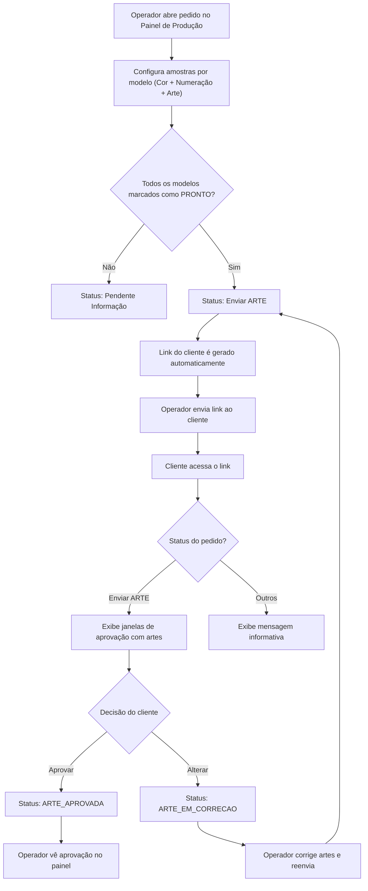
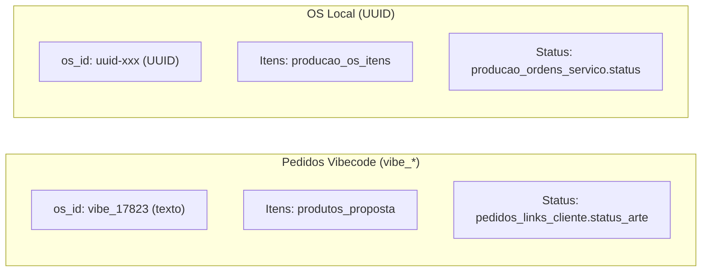

# Fluxo de Aprovação de Arte - Ideal Imposition

Documentação técnica e operacional do fluxo completo de aprovação de artes pelo cliente.

---

## Visão Geral

O sistema permite que o operador da gráfica prepare amostras de arte para cada modelo do pedido e envie um **link público** ao cliente para aprovação. O cliente acessa esse link, visualiza as artes e pode **aprovar** ou **solicitar alteração** em cada modelo.



---

## Tabelas do Banco de Dados (Supabase)

### `pedidos_links_cliente`
Armazena o vínculo entre pedido e link público do cliente.

| Coluna | Tipo | Descrição |
|--------|------|-----------|
| `id` | UUID (PK) | ID único do registro |
| `os_id` | TEXT (UNIQUE) | ID da OS (ex: `vibe_17823`) |
| `numero_pedido` | TEXT | Número visível do pedido (ex: `17823`) |
| `token` | VARCHAR(12) | Token único que compõe a URL |
| `id_int` | TEXT | Número inteiro do pedido (redundância) |
| `status_arte` | TEXT | **Status atual da arte** — controla o que o cliente vê |
| `created_at` | TIMESTAMPTZ | Data de criação do link |
| `acessos` | INTEGER | Contador de acessos do cliente |
| `ultimo_acesso` | TIMESTAMPTZ | Último acesso registrado |
| `ativo` | BOOLEAN | Se o link está ativo (desativável pelo operador) |

> [!IMPORTANT]
> A coluna `status_arte` é a **fonte de verdade** para pedidos Vibecode (`vibe_*`). Para OSs locais (UUID), o status é lido de `producao_ordens_servico`.

### `produtos_proposta`
Itens/modelos do pedido vindos do Vibecode.

| Coluna Relevante | Descrição |
|------------------|-----------|
| `id` | ID numérico do item |
| `id_int` | Número do pedido pai |
| `nome_produto` | Nome do produto (Triband, Mobi, etc.) |
| `modelo_descri` | Formato do modelo |
| `qtd` | Quantidade |
| `amostra_arte_base64` | Arte em base64 (imagem ou PDF) |
| `amostra_cor_id` | ID da cor selecionada |
| `amostra_num_id` | ID da numeração selecionada |
| `amostra_status` | Status individual do item (`PENDENTE`, `PRONTO`, `APROVADA`, `REPROVADA`) |
| `amostra_obs` | Observações/motivo de alteração |

### `propostas_chat`
Log de mensagens do pedido (visível no chat do ERP Vibecode).

---

## Quem manda na Cor e na Numeração do modelo

A linha de `pedidos_modelos` guarda o mesmo fato duas vezes: o **nome**, que o
sistema parceiro escreve (`padrao` e `gabarito_operacional`), e o **id**, que
este painel deriva depois (`amostra_cor_id` e `amostra_num_id`).

Quando os dois discordam, **o nome vence** — ele é a origem. Medido no banco em
12/08/2026: 36 modelos tinham `padrao` sem id e nenhum tinha id sem `padrao`.
Enquanto o id vencia, uma troca de cor feita no ERP depois do primeiro
salvamento nunca mais chegava à tela, nem apertando F5, porque o desencontro
mora na linha do banco e não em cache do navegador.

A regra **não é igual para a numeração**: uma numeração customizada é gravada só
no `amostra_num_id` e deixa o `gabarito_operacional` no gabarito base, então
seguir o texto ali devolveria a numeração de fábrica e apagaria o trabalho do
operador. Os detalhes, os casos de borda e o motivo de cada guarda estão no
cabeçalho de `frontend/cor-numeracao-do-modelo.js`, e os testes em
`tests/CorNumeracaoDoModelo.Tests.ps1`.

A correção acontece ao **carregar o pedido** (`loadOSItens` no painel e o
carregador do `cliente.js` no link), vale em memória, e aparece na tela como um
aviso dizendo o que mudou — trocar cor ou numeração muda o que sai na
impressora, e o operador precisa ver acontecer. O banco se acerta sozinho no
próximo salvamento do modelo.

---

## Status da Arte e Mensagens ao Cliente

O status da arte controla **exatamente** o que o cliente vê ao acessar o link:

| Status | Quem Define | O que o Cliente Vê |
|--------|-------------|---------------------|
| `Enviar ARTE` | Operador (via "Voltar Atendimento") | ✅ **Janelas de aprovação** com artes renderizadas, botões Aprovar/Alterar |
| `ARTE_APROVADA` / `Arte APROVADA` | Cliente (ao aprovar) | ✅ "Artes Aprovadas! Em breve seu pedido entrará em produção." |
| `ARTE_EM_CORRECAO` | Cliente (ao solicitar alteração) | 🔧 "Artes em Correção. Em breve você receberá um novo link." |
| `ARTE_EM_ANDAMENTO` | Default / Operador | 🎨 "Arte em Produção. Nossa equipe está trabalhando nas artes." |
| `Pendente Informação` | Operador (itens não prontos) | 📋 "Aguardando Informações. Entre em contato com seu atendimento." |
| `EM IMPRESSÃO` | Operador | 🖨️ "Pedido em Produção. Artes aprovadas e em impressão." |
| Qualquer outro | — | ℹ️ "Pedido em Processamento." |

> [!CAUTION]
> **Apenas** o status `Enviar ARTE` libera as janelas de aprovação. Todos os outros exibem apenas uma mensagem informativa, sem interação.

---

## Fluxo Detalhado — Passo a Passo

### 1. Preparação pelo Operador (Painel Interno)

1. Operador abre o pedido no **Painel da Produção**
2. Clica no pedido para expandir os detalhes → aba **Amostras**
3. Para cada modelo (item) do pedido:
   - Seleciona **Cor Cadastrada** (dropdown com cores do formato)
   - Seleciona **Numeração Cadastrada** (dropdown filtrado pela cor)
   - Faz **Upload da Arte** (PDF, JPG ou PNG)
   - A visualização combinada é renderizada em tempo real no canvas
4. Marca cada modelo como **🎨 PRONTO** (botão na decisão de qualidade)

### 2. Envio ao Cliente

5. Clica em **"Voltar para Atendimento"**
6. O sistema verifica se **todos** os modelos estão com `amostra_status === 'PRONTO'`
   - **Sim** → status muda para `Enviar ARTE`, link é gerado automaticamente e copiado para a área de transferência
   - **Não** → status muda para `Pendente Informação`, alerta ao operador
7. O link gerado tem formato: `https://dominio.com/cliente/{numero}-{token}` (ex: `/cliente/17823-zi1v27`)

### 3. Acesso pelo Cliente

8. Cliente acessa o link no navegador
9. Função `checkClienteRoute()` detecta a rota `/cliente/{numero}-{token}`
10. Função `initClientePage(numero, token)` executa:
    - Valida token na tabela `pedidos_links_cliente` (busca por `numero_pedido`, `token`, `ativo=true`)
    - Incrementa contador de `acessos`
    - Carrega dados do cliente de `propostas`
    - Carrega formatos, cores e numerações para renderização
    - **Carrega itens** de `produtos_proposta` (mapeados via `mapVibecodeProdutoToOSItem`)
    - Mescla dados de `pedidos_artes` (se houver PDFs e versões)
    - **Lê o status** de `pedidos_links_cliente.status_arte`
    - Executa o `switch(osStatus)` que decide o que mostrar

### 4. Aprovação pelo Cliente

11. Se status = `Enviar ARTE`: cliente vê as janelas com:
    - Canvas renderizado com a arte combinada (cor + numeração + arte)
    - Botão **✅ APROVAR** e **❌ ALTERAR** por modelo
    - Campo de **observações** para detalhar alterações
    - Botão global **FINALIZAR E APROVAR PEDIDO COMPLETO**

12. **Se Aprovar** (`clienteFinalizarFluxo('APROVAR_TUDO')`):
    - Status global → `ARTE_APROVADA`
    - Cada item → `amostra_status: 'APROVADA'`
    - Log no chat: "PEDIDO COMPLETO APROVADO PELO CLIENTE"
    - Tela de sucesso: "Pedido Aprovado com Sucesso!"

13. **Se Solicitar Alteração** (`clienteFinalizarFluxo('SOLICITAR_ALTERACAO')`):
    - Status global → `ARTE_EM_CORRECAO`
    - Log no chat com observações de cada modelo reprovado
    - Tela: "Alteração Solicitada!"

### 5. Retorno ao Operador

14. Operador vê a mudança de status no painel (badge atualizado)
15. Se foi alteração: operador corrige artes, marca PRONTO novamente, e clica "Voltar para Atendimento" → ciclo recomeça

---

## Arquitetura de Dados — Pedidos Vibecode vs. OS Local



> [!NOTE]
> As tabelas `producao_ordens_servico` e `producao_os_itens` usam **UUID** como tipo de ID. Pedidos do Vibecode usam IDs no formato `vibe_{numero}` (texto). Por isso, para pedidos Vibecode, o sistema usa rotas alternativas:
> - **Itens**: `produtos_proposta` (via `id_int`)
> - **Status**: `pedidos_links_cliente.status_arte` (via `os_id`)

---

## Funções Principais (script.js)

### Painel do Operador

| Função | Linha | Descrição |
|--------|-------|-----------|
| [renderAmostrasOSItens](file:///C:/Users/Junior/Projetos%20Ingresso%20ideal/ideal-imposition/frontend/script.js#L12570) | ~12570 | Renderiza as janelas de cada modelo com dropdowns de cor/num, upload de arte, botões de decisão |
| [renderItemAmostraCombinada](file:///C:/Users/Junior/Projetos%20Ingresso%20ideal/ideal-imposition/frontend/script.js#L13110) | ~13110 | Desenha a visualização combinada (cor + numeração + arte) no canvas |
| [voltarParaAtendimento](file:///C:/Users/Junior/Projetos%20Ingresso%20ideal/ideal-imposition/frontend/script.js#L12815) | ~12815 | Verifica se todos os modelos estão PRONTO, atualiza status e gera link |
| [changeOSStatus](file:///C:/Users/Junior/Projetos%20Ingresso%20ideal/ideal-imposition/frontend/script.js#L12099) | ~12099 | Altera status da OS (localStorage + Supabase) |
| [getOrCreateLinkCliente](file:///C:/Users/Junior/Projetos%20Ingresso%20ideal/ideal-imposition/frontend/script.js#L13944) | ~13944 | Busca ou cria o link do cliente na tabela `pedidos_links_cliente` |
| [gerarLinkCliente](file:///C:/Users/Junior/Projetos%20Ingresso%20ideal/ideal-imposition/frontend/script.js#L13989) | ~13989 | Wrapper que gera link, copia para clipboard e exibe toast |
| [saveAmostraToDB](file:///C:/Users/Junior/Projetos%20Ingresso%20ideal/ideal-imposition/frontend/script.js#L13030) | ~13030 | Salva dados de amostra (cor, numeração, arte, status) no banco |

### Página do Cliente

> ⚠️ **Esta tabela está desatualizada.** A página do cliente saiu do `script.js` e hoje
> vive inteira em **`frontend/cliente.js`**, que é o único script que a `cliente.html`
> carrega (além do pdf.js e do Supabase). Os links e números de linha abaixo apontam
> para um arquivo onde essas funções **não existem mais** — `checkClienteRoute` e
> `initClientePage` têm zero ocorrências no `script.js`. Use `cliente.js` como fonte.

| Função | Linha | Descrição |
|--------|-------|-----------|
| [checkClienteRoute](file:///C:/Users/Junior/Projetos%20Ingresso%20ideal/ideal-imposition/frontend/script.js#L14016) | ~14016 | Detecta URL `/cliente/{numero}-{token}` e inicia fluxo |
| [initClientePage](file:///C:/Users/Junior/Projetos%20Ingresso%20ideal/ideal-imposition/frontend/script.js#L14049) | ~14049 | Valida token, carrega dados, decide o que mostrar pelo status |
| [clienteFinalizarFluxo](file:///C:/Users/Junior/Projetos%20Ingresso%20ideal/ideal-imposition/frontend/script.js#L14323) | ~14323 | Processa aprovação ou solicitação de alteração |
| [clienteAprovarTudo](file:///C:/Users/Junior/Projetos%20Ingresso%20ideal/ideal-imposition/frontend/script.js#L14451) | ~14451 | Atalho para `clienteFinalizarFluxo('APROVAR_TUDO')` |
| [mostrarResultadoCliente](file:///C:/Users/Junior/Projetos%20Ingresso%20ideal/ideal-imposition/frontend/script.js#L14455) | ~14455 | Exibe tela de resultado (ícone + título + mensagem) |
| [mapVibecodeProdutoToOSItem](file:///C:/Users/Junior/Projetos%20Ingresso%20ideal/ideal-imposition/frontend/script.js#L11276) | ~11276 | Converte item de `produtos_proposta` para o formato interno `osItem` |

---

## O viewer de PDF multipáginas do link do cliente

Item em **modo PDF** não usa o canvas de composição (`#amostra-item-canvas-N`): ele tem
um viewer próprio, com `#amostra-pdf-canvas-N` e os botões ◀ ▶. Três coisas a saber
antes de mexer, todas aprendidas na v507:

**1. Existe um único ponto de entrada, e tem que continuar assim.**
`renderAmostrasOSItens()` agenda o desenho dos itens aos 50 ms; para item em modo PDF,
o caminho é `renderItemAmostraCombinada` → `drawAmostraFace` → `initPdfViewer`. Até a
v506 havia um **segundo** laço, aos 200 ms, chamando `initPdfViewer` de novo para os
mesmos itens, sem guarda nenhuma. Não acrescente outro: a condição do laço dos 50 ms já
inclui `item.modo_pdf`, e o painel interno (`script.js`) sempre viveu com um caminho só.

**2. Dois `page.render()` no mesmo canvas se corrompem, e o erro é silencioso.**
`desenharPaginaDoPdf()` começa reatribuindo `canvas.width`/`height`, o que zera o canvas
**e a transformação** que o pdf.js aplicou ao contexto. Fazer isso durante outro desenho
produz `Cannot use the same canvas during multiple render() operations`, que o `catch`
transforma num `console.error`. O que sobra na tela é a página em escala errada e
espelhada — foi exatamente o sintoma da v507. Por isso `renderPdfViewerPage()` hoje é só
um enfileirador: ele encadeia os desenhos por item e delega a `desenharPaginaDoPdf()`.

**3. A fila mora fora do `pdfViewerState`, de propósito.**
`initPdfViewer` **substitui** `pdfViewerState[idx]` por um objeto novo. Uma fila guardada
dentro dele nasceria vazia a cada inicialização e não serializaria justamente as duas
chamadas que se atropelam. Ela vive no mapa `pdfRenderQueue`, à parte. Se algum dia essa
fila for movida para dentro do estado, o bug da v507 volta.

Como a corrupção depende de como os downloads se intercalam, ela é **intermitente**:
reproduzir uma vez e ver a tela certa não prova nada. O teste da v507 varre quatro
atrasos de rede e compara o canvas pixel a pixel contra o mesmo canvas depois de navegar
e voltar.

---

## URL do Cliente

**Formato:** `https://{dominio}/cliente/{numero_pedido}-{token}`

**Exemplo:** `https://imposicao.vercel.app/cliente/17823-zi1v27`

- O `numero_pedido` é o número visível do pedido
- O `token` é um código alfanumérico de 6 caracteres gerado aleatoriamente
- A combinação `numero + token` garante segurança (o cliente não consegue adivinhar)
- O link pode ser **desativado** pelo operador (campo `ativo = false`)

---

## SQL de Criação da Tabela

```sql
CREATE TABLE IF NOT EXISTS public.pedidos_links_cliente (
    id UUID DEFAULT gen_random_uuid() PRIMARY KEY,
    os_id TEXT NOT NULL,
    numero_pedido TEXT NOT NULL,
    token VARCHAR(12) NOT NULL,
    id_int TEXT,
    status_arte TEXT DEFAULT NULL,
    created_at TIMESTAMPTZ DEFAULT now(),
    acessos INTEGER DEFAULT 0,
    ultimo_acesso TIMESTAMPTZ,
    ativo BOOLEAN DEFAULT true,
    UNIQUE(os_id)
);

CREATE INDEX IF NOT EXISTS idx_link_cliente_token 
ON public.pedidos_links_cliente(numero_pedido, token);
```
