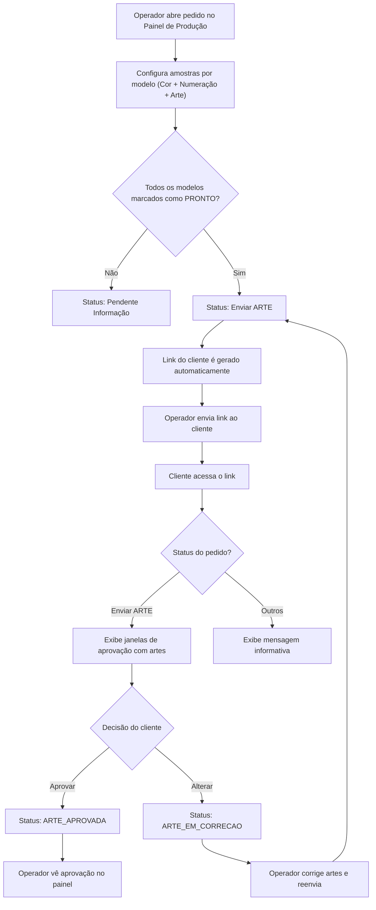
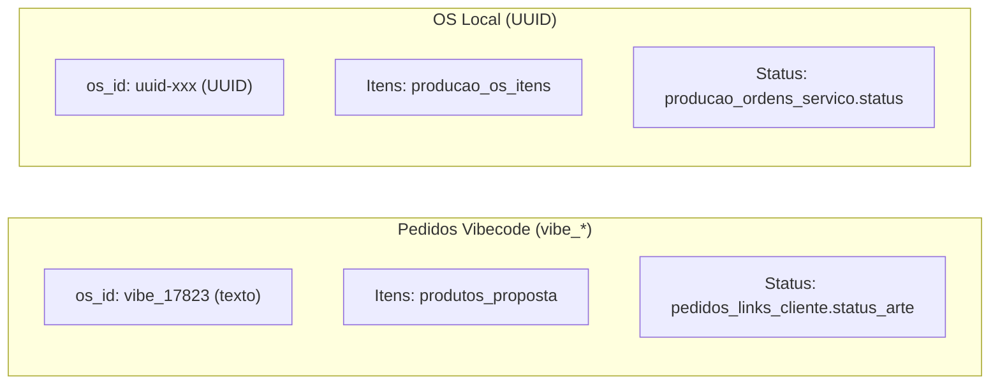

# Fluxo de Aprovação de Arte - Ideal Imposition

Documentação técnica e operacional do fluxo completo de aprovação de artes pelo cliente.

---

## Visão Geral

O sistema permite que o operador da gráfica prepare amostras de arte para cada modelo do pedido e envie um **link público** ao cliente para aprovação. O cliente acessa esse link, visualiza as artes e pode **aprovar** ou **solicitar alteração** em cada modelo.



---

## Tabelas do Banco de Dados (Supabase)

### `pedidos_links_cliente`
Armazena o vínculo entre pedido e link público do cliente.

| Coluna | Tipo | Descrição |
|--------|------|-----------|
| `id` | UUID (PK) | ID único do registro |
| `os_id` | TEXT (UNIQUE) | ID da OS (ex: `vibe_17823`) |
| `numero_pedido` | TEXT | Número visível do pedido (ex: `17823`) |
| `token` | VARCHAR(12) | Token único que compõe a URL |
| `id_int` | TEXT | Número inteiro do pedido (redundância) |
| `status_arte` | TEXT | **Status atual da arte** — controla o que o cliente vê |
| `created_at` | TIMESTAMPTZ | Data de criação do link |
| `acessos` | INTEGER | Contador de acessos do cliente |
| `ultimo_acesso` | TIMESTAMPTZ | Último acesso registrado |
| `ativo` | BOOLEAN | Se o link está ativo (desativável pelo operador) |

> [!IMPORTANT]
> A coluna `status_arte` é a **fonte de verdade** para pedidos Vibecode (`vibe_*`). Para OSs locais (UUID), o status é lido de `producao_ordens_servico`.

### `produtos_proposta`
Itens/modelos do pedido vindos do Vibecode.

| Coluna Relevante | Descrição |
|------------------|-----------|
| `id` | ID numérico do item |
| `id_int` | Número do pedido pai |
| `nome_produto` | Nome do produto (Triband, Mobi, etc.) |
| `modelo_descri` | Formato do modelo |
| `qtd` | Quantidade |
| `amostra_arte_base64` | Arte em base64 (imagem ou PDF) |
| `amostra_cor_id` | ID da cor selecionada |
| `amostra_num_id` | ID da numeração selecionada |
| `amostra_status` | Status individual do item (`PENDENTE`, `PRONTO`, `APROVADA`, `REPROVADA`) |
| `amostra_obs` | Observações/motivo de alteração |

### `propostas_chat`
Log de mensagens do pedido (visível no chat do ERP Vibecode).

> [!WARNING]
> **As sete inserções que o painel faz nesta tabela nunca gravaram nada.** Elas
> mandam a coluna `remetente_nome`, que não existe — a coluna é `autor_nome`, e o
> PostgREST recusa a escrita inteira. Verificado no banco em 19/08/2026: zero
> linhas nossas.
>
> Ficou assim de propósito, à espera de decisão: consertar o nome da coluna, ou
> remover as inserções. Enquanto isso, **não confie neste log** para saber o que o
> cliente disse. A caixa de entrega chegou a exibir uma nota de PIX do Financeiro
> como "solicitação do cliente" por ler daqui — esse plano B foi removido em v647.

---

## Quem manda na Cor e na Numeração do modelo

A linha de `pedidos_modelos` guarda o mesmo fato duas vezes: o **nome**, que o
sistema parceiro escreve (`padrao` e `gabarito_operacional`), e o **id**, que
este painel deriva depois (`amostra_cor_id` e `amostra_num_id`).

Quando os dois discordam, **o nome vence** — ele é a origem. Medido no banco em
12/08/2026: 36 modelos tinham `padrao` sem id e nenhum tinha id sem `padrao`.
Enquanto o id vencia, uma troca de cor feita no ERP depois do primeiro
salvamento nunca mais chegava à tela, nem apertando F5, porque o desencontro
mora na linha do banco e não em cache do navegador.

A regra **não é igual para a numeração**: uma numeração customizada é gravada só
no `amostra_num_id` e deixa o `gabarito_operacional` no gabarito base, então
seguir o texto ali devolveria a numeração de fábrica e apagaria o trabalho do
operador. Os detalhes, os casos de borda e o motivo de cada guarda estão no
cabeçalho de `frontend/cor-numeracao-do-modelo.js`, e os testes em
`tests/CorNumeracaoDoModelo.Tests.ps1`.

A correção acontece ao **carregar o pedido** (`loadOSItens` no painel e o
carregador do `cliente.js` no link), vale em memória, e aparece na tela como um
aviso dizendo o que mudou — trocar cor ou numeração muda o que sai na
impressora, e o operador precisa ver acontecer. O banco se acerta sozinho no
próximo salvamento do modelo.

---

## O Portal do Pedido (20/08/2026)

> [!IMPORTANT]
> **A página do cliente deixou de ser um funil.** Até 20/08/2026 ela só mostrava
> alguma coisa quando o `status_arte` valia `Enviar Arte` ou `Aguard. Aprovação`
> — ou quando o atendente girava o selo de entrega para `ALTERADO`. Medido no
> banco naquele dia: **36 dos 50 links estavam num status em que a página não
> mostrava nada.**
>
> Hoje ela é o **Portal do Pedido**: cinco seções sempre abertas, com barra de
> abas no rodapé, e a aprovação de arte é uma delas. O que o status decide agora
> é só a **cara da aba da arte**.

### As cinco seções

| aba | arquivo | fonte dos dados |
|---|---|---|
| 🎨 Arte | `cliente.js` (`desenharSecaoArte`) | `pedidos_modelos` + catálogos |
| 📦 Entrega | `cliente-entrega.js` | `enderecos`, `propostas`, `propostas_os`, `produtos.prazo`, `cotacao_frete` |
| 🧾 Nota | `cliente-faturamento.js` | `clientes` (cinco campos) |
| 💰 Orçamento | `cliente-orcamento.js` | `propostas.texto_whatsapp`, com `produtos_proposta` de reserva |
| 💳 Pagar | `cliente-pagamento.js` | `propostas_os.link_pagamento` |

O casco — cabeçalho, selo de status, barra de abas e troca de seção — está em
`cliente-shell.js`. As duas decisões do cliente (entrega e faturamento) estão em
`cliente-confirmacoes.js`. A carga dos dados e as contas de formatação estão em
`cliente-dados.js`. **O motor de desenho da arte não saiu do `cliente.js`**: onze
arquivos de teste apontam para ele pelo nome, e cinco recortam funções de lá para
executar.

### Uma consulta só, pela função do banco

`link_cliente_pedido(p_numero, p_token)` (`sql/link_cliente_pedido.sql`) devolve
num `jsonb` só tudo o que as cinco abas mostram, exigindo o par número+token de um
link ativo. É o mesmo desenho da `link_cliente_abrir`.

Ela substituiu **seis consultas diretas** feitas com a chave anônima — a que está
no código-fonte da página. Uma delas era `select('*')` em `clientes`, que trazia
`limite_credito`, `risco_credito` e `total_compras` junto do nome e do CNPJ que a
tela mostra. Com valores entrando na página (orçamento, frete, total, link de
pagamento), a porta precisava mudar antes do dinheiro.

O arquivo SQL é **aditivo**: ele não revoga privilégio de tabela nenhuma. As
tabelas do parceiro continuam abertas à chave anônima — fechá-las não é decisão
deste projeto e quebraria telas do ERP. O que mudou é que a página pública parou
de usar aquela porta.

### As duas confirmações, e as três chaves

Entrega e faturamento eram um cartão só, com um par de botões e um campo de texto
gravado em `pedidos_artes.observacoes.correcao_entrega_faturamento`. Agora cada
aba tem a sua decisão e a sua chave:

| chave | quem escreve |
|---|---|
| `correcao_entrega` | a aba 📦 Entrega |
| `correcao_faturamento` | a aba 🧾 Nota |
| `correcao_entrega_faturamento` | **ninguém mais** — é a chave dos pedidos já gravados, e continua sendo LIDA |

Não precisou coluna nova: `observacoes` é `jsonb`. O selo continua sendo um só,
`entrega_dados`: as duas confirmadas → `APROVADO`; qualquer uma com correção →
`CORRIGIR`. `ALTERADO` continua nascendo só do atendente, na Lista de Arte.

O painel (`loadDadosEntregaInterno`) mostra as três, e as duas novas vêm
rotuladas — antes o atendente recebia um texto onde os dois assuntos se
misturavam.

### Os dois prazos da aba de Entrega

Por decisão do usuário em 20/08/2026, a aba mostra **prazo de produção** e
**prazo de envio** separados, e não um só. São duas coisas diferentes, com duas
origens diferentes — somadas num número só, ninguém saberia qual das duas
atrasou quando o pedido atrasa.

| linha | origem | regra |
|---|---|---|
| Prazo de produção | `produtos.prazo`, pelos itens do pedido | o do produto que demora MAIS: a gráfica só despacha quando o último item fica pronto |
| Prazo de envio | `cotacao_frete.prazo` da linha `escolhido` | o que a transportadora prometeu, passado como está |

A comparação da produção é feita pelo **número**, e não pelo texto: o catálogo
tem cinco redações para a mesma coisa — "3 dias úteis" (50 produtos), "1 dia
útil" (7), "2 dias úteis" (3), "Prazo de produção 2 dias úteis" e "Produção: 1
dia útil + Frete" (um cada).

O prazo de envio passa **inteiro**, sem reescrita: "A combinar" (1.274 cotações),
"1 dia útil" (227), "Imediato", "Sob consulta", "De 12 até 48hs ( consultar )",
"dia seguinte a conclusão". Reescrever qualquer uma dessas seria inventar uma
promessa de entrega que a gráfica não fez. A única correção é o número solto: 30
cotações do SEDEX gravam só `1`, e outras 227 gravam `1 dia útil` — é a mesma
coisa com a unidade perdida.

> [!NOTE]
> `propostas_os.data_termino` **não aparece mais** nesta aba. Ela continua sendo
> o Prazo de Entrega do Painel de Produção; o que o cliente vê agora são os dois
> prazos acima, que é o que ele perguntaria ao atendimento.

---

### O que o Orçamento mostra, e por quê

`propostas.texto_whatsapp` — o resumo que o ERP monta e o vendedor manda ao fechar
o pedido. Preenchido em 1.436 dos 1.489 pedidos dos últimos 30 dias.

Remontar o orçamento a partir de `produtos_proposta` daria uma **segunda versão do
mesmo número**, e duas versões do mesmo preço na frente do cliente é o que uma
página de gráfica não pode fazer. Só nos 4% sem resumo é que a lista é montada
pelos itens.

O `*negrito*` do WhatsApp vira `<b>` **depois** de o texto ser escapado: ele vem do
banco do parceiro e vai para dentro de `innerHTML`.

---

## Status da Arte e o que o cliente vê

O status vive em `pedidos_links_cliente.status_arte`, que é **texto livre** e foi
escrito por três telas ao longo de um ano. As grafias que existem de verdade no
banco, lidas em 20/08/2026 nos 50 links:

| status_arte | links | selo no cabeçalho | a aba da arte mostra |
|---|---|---|---|
| `EM PRODUCAO` | 29 | Pedido em produção | as artes aprovadas, só leitura |
| `APROVADO` | 7 | Artes aprovadas | as artes aprovadas, só leitura |
| `Em Arte` | 5 | Arte em preparação | a mensagem de preparação |
| (nulo) | 5 | Arte em preparação | a mensagem de preparação |
| `Enviar Arte` | 2 | Aguardando sua aprovação | a aprovação, com os botões |
| `Aguard. Aprovação` | 2 | Aguardando sua aprovação | a aprovação, com os botões |

A documentação antiga citava `ARTE_APROVADA`, `ARTE_EM_CORRECAO`,
`ARTE_EM_ANDAMENTO` e `Enviar ARTE` — grafias que o código antigo escrevia e que
**não existem mais no banco**. Elas continuam sendo entendidas: quem traduz é
`seloDoStatus`, no `cliente-shell.js`, que compara sem acento e por trecho, e tem
teste para as seis grafias. Um status novo que o ERP invente cai em "Arte em
preparação" — nunca numa tela em branco.

> [!NOTE]
> As **outras quatro abas abrem em qualquer status**. O status decide só a aba da
> arte. Era o contrário até 20/08/2026: o status decidia se a página inteira
> mostrava alguma coisa.

---

## Fluxo Detalhado — Passo a Passo

### 1. Preparação pelo Operador (Painel Interno)

1. Operador abre o pedido no **Painel da Produção**
2. Clica no pedido para expandir os detalhes → aba **Amostras**
3. Para cada modelo (item) do pedido:
   - Seleciona **Cor Cadastrada** (dropdown com cores do formato)
   - Seleciona **Numeração Cadastrada** (dropdown filtrado pela cor)
   - Faz **Upload da Arte** (PDF, JPG ou PNG)
   - A visualização combinada é renderizada em tempo real no canvas
4. Marca cada modelo como **🎨 PRONTO** (botão na decisão de qualidade)

> [!IMPORTANT]
> Desde 19/08/2026, marcar PRONTO **gera e salva a arte de amostra de novo**. Antes
> ela ficava com a versão anterior depois de uma correção, e era essa versão velha
> que o cliente via. Se a geração falhar, o modelo **não** é marcado como pronto e
> o operador é avisado — mandar link com arte velha é pior do que não mandar.
>
> Marcar PRONTO também exige que a **Qtd do modelo bata com as células geradas**
> (igual à Qtd na frente, o dobro em Frente × Verso). Divergiu, o pedido não anda
> até alguém corrigir as linhas da numeração. A `Qtd` nunca é escrita de volta no
> banco: ela é a quantidade contratada.

### 2. Envio ao Cliente

5. Clica em **"Voltar para Atendimento"**
6. O sistema verifica se **todos** os modelos estão com `amostra_status === 'PRONTO'`
   - **Sim** → status muda para `Enviar ARTE`, link é gerado automaticamente e copiado para a área de transferência
   - **Não** → status muda para `Pendente Informação`, alerta ao operador
7. O link gerado tem formato: `https://dominio.com/cliente/{numero}-{token}` (ex: `/cliente/17823-zi1v27`)

### 3. Acesso pelo Cliente

8. Cliente acessa o link no navegador
9. Função `checkClienteRoute()` detecta a rota `/cliente/{numero}-{token}`
10. Função `initClientePage(numero, token)` executa:
    - Valida token na tabela `pedidos_links_cliente` (busca por `numero_pedido`, `token`, `ativo=true`)
    - Incrementa contador de `acessos`
    - Carrega dados do cliente de `propostas`
    - Carrega formatos, cores e numerações para renderização
    - **Carrega itens** de `produtos_proposta` (mapeados via `mapVibecodeProdutoToOSItem`)
    - Mescla dados de `pedidos_artes` (se houver PDFs e versões)
    - **Lê o status** de `pedidos_links_cliente.status_arte`
    - Executa o `switch(osStatus)` que decide o que mostrar

### 4. Aprovação pelo Cliente

11. Se status = `Enviar ARTE`: cliente vê as janelas com:
    - Canvas renderizado com a arte combinada (cor + numeração + arte)
    - Botão **✅ APROVAR** e **❌ ALTERAR** por modelo
    - Campo de **observações** para detalhar alterações
    - Botão global **FINALIZAR E APROVAR PEDIDO COMPLETO**

12. **Se Aprovar** (`clienteFinalizarFluxo('APROVAR_TUDO')`):
    - Status global → `ARTE_APROVADA`
    - Cada item → `amostra_status: 'APROVADA_CLIENTE'`
    - Log no chat: "PEDIDO COMPLETO APROVADO PELO CLIENTE"
    - Tela de sucesso: "Pedido Aprovado com Sucesso!"

> [!NOTE]
> **Quem aprovou fica registrado no próprio valor**, e não numa coluna nova:
> `APROVADA_CLIENTE` é o botão APROVAR do link do cliente; `APROVADA` é o ✅
> APROVADO do painel, apertado pelo atendente. O aviso do modelo travado diz qual
> dos dois foi.
>
> Os dois valores já eram lidos como aprovado em todo o código — nas listas de
> aprovado, no mapa de selos e no remapeamento da carga —, então não é vocabulário
> novo para o sistema parceiro.
>
> O link do cliente **não** passa pelo `script.js`: `cliente.js` tem o próprio
> `saveAmostraToDB`, e `cliente.html` não carrega o arquivo do painel.

13. **Se Solicitar Alteração** (`clienteFinalizarFluxo('SOLICITAR_ALTERACAO')`):
    - Status global → `ARTE_EM_CORRECAO`
    - Log no chat com observações de cada modelo reprovado
    - Tela: "Alteração Solicitada!"

### 4b. A alteração dos dados de nota fiscal e entrega

Depois das artes, o cliente confere **os dados de faturamento e o endereço de
entrega**. São dois botões — CONFIRMAR e ALTERAR — e, no ALTERAR, um único campo
de texto: *"Informe aqui quais dados de faturamento e/ou endereço de entrega
precisam ser corrigidos"*.

Esse texto mora em **`pedidos_artes.observacoes.correcao_entrega_faturamento`**,
tabela nossa, e é o que o painel mostra dentro do pedido, na caixa "Dados de
Entrega / Faturamento Alterados" (`loadDadosEntregaInterno`). Não havendo texto,
o painel cai numa frase genérica — e é assim que se percebe que a gravação
falhou.

> [!CAUTION]
> **A linha do pedido em `pedidos_artes` precisa existir ANTES de o link ir ao
> cliente.** A tela do cliente roda como `anon` (o link não tem sessão do
> Supabase) e a RLS recusa INSERT ali — `42501, new row violates row-level
> security policy`. Ler e atualizar, ela pode; criar, não.
>
> Até 20/08/2026 ninguém criava essa linha no caminho do cliente: havia 38 linhas
> para 8.263 propostas, porque ela só nascia no briefing do painel. E como a
> gravação era um `.update()` solto, o texto ia embora **calado** — um UPDATE que
> não acha linha nenhuma responde `200` com `[]`, sem erro, e o `supabase-js` não
> lança.
>
> Hoje quem cria a linha é `garantirLinhaDePedidoArte`, chamada por
> `getOrCreateLinkCliente` — no painel, com usuário logado, no momento em que o
> pedido vai para o cliente. Quem grava do lado do cliente é
> `gravarCorrecaoDoCliente`, que pede as linhas afetadas de volta e **devolve o
> resultado**; se não gravou, o cliente vê um aviso com o número do pedido em vez
> de "Pedido Aprovado com Sucesso".

O botão **💾 Salvar Correção** grava na hora. Quem decide o `entrega_dados`
(`CORRIGIR` ou `APROVADO`) continua sendo o botão final da página — por isso
`gravarCorrecaoDoCliente` aceita status nulo, que grava o texto sem mexer no
estado do pedido.

O `entrega_dados` tem um quarto valor, `ALTERADO`, que **não vem do cliente**:
ele só nasce do atendente girando o selo na Lista de Arte
(`alterarEntregaDadosStatus`, que cicla APROVADO → ALTERADO → CORRIGIR → ----).
Um pedido em `ALTERADO` sem texto do cliente é isso, e não uma gravação perdida.

### 5. Retorno ao Operador

14. Operador vê a mudança de status no painel (badge atualizado)
15. Se foi alteração: operador corrige artes, marca PRONTO novamente, e clica "Voltar para Atendimento" → ciclo recomeça

---

## Arquitetura de Dados — Pedidos Vibecode vs. OS Local



> [!NOTE]
> As tabelas `producao_ordens_servico` e `producao_os_itens` usam **UUID** como tipo de ID. Pedidos do Vibecode usam IDs no formato `vibe_{numero}` (texto). Por isso, para pedidos Vibecode, o sistema usa rotas alternativas:
> - **Itens**: `produtos_proposta` (via `id_int`)
> - **Status**: `pedidos_links_cliente.status_arte` (via `os_id`)

---

## Funções Principais (script.js)

### Painel do Operador

| Função | Linha | Descrição |
|--------|-------|-----------|
| [renderAmostrasOSItens](file:///C:/Users/Junior/Projetos%20Ingresso%20ideal/ideal-imposition/frontend/script.js#L12570) | ~12570 | Renderiza as janelas de cada modelo com dropdowns de cor/num, upload de arte, botões de decisão |
| [renderItemAmostraCombinada](file:///C:/Users/Junior/Projetos%20Ingresso%20ideal/ideal-imposition/frontend/script.js#L13110) | ~13110 | Desenha a visualização combinada (cor + numeração + arte) no canvas |
| [voltarParaAtendimento](file:///C:/Users/Junior/Projetos%20Ingresso%20ideal/ideal-imposition/frontend/script.js#L12815) | ~12815 | Verifica se todos os modelos estão PRONTO, atualiza status e gera link |
| [changeOSStatus](file:///C:/Users/Junior/Projetos%20Ingresso%20ideal/ideal-imposition/frontend/script.js#L12099) | ~12099 | Altera status da OS (localStorage + Supabase) |
| [getOrCreateLinkCliente](file:///C:/Users/Junior/Projetos%20Ingresso%20ideal/ideal-imposition/frontend/script.js#L13944) | ~13944 | Busca ou cria o link do cliente na tabela `pedidos_links_cliente` |
| [gerarLinkCliente](file:///C:/Users/Junior/Projetos%20Ingresso%20ideal/ideal-imposition/frontend/script.js#L13989) | ~13989 | Wrapper que gera link, copia para clipboard e exibe toast |
| [saveAmostraToDB](file:///C:/Users/Junior/Projetos%20Ingresso%20ideal/ideal-imposition/frontend/script.js#L13030) | ~13030 | Salva dados de amostra (cor, numeração, arte, status) no banco |

### Página do Cliente

Ela saiu do `script.js` faz tempo, e desde 20/08/2026 mora em sete arquivos, que a
`cliente.html` carrega nesta ordem (a ordem importa: `cliente-shell.js` precisa
existir antes das abas, que se registram ao serem lidas).

| arquivo | o que contém |
|---|---|
| `cliente-dados.js` | `carregarPortal` (a RPC), `emReal`, `rotuloDoFrete`, `prazoDeProducao`, `prazoDoFrete`, `enderecoEmLinhas`, `linkDeRastreio` |
| `cliente-shell.js` | `seloDoStatus`, `abrirSecao`, `registrarSecao`, `redesenharSecao`, `montarPortal` |
| `cliente-confirmacoes.js` | `cartaoDeDecisao`, `cartaoDeFinalizacao`, `decidirDados`, `salvarCorrecaoDeDados`, `finalizarNoPortal` |
| `cliente-entrega.js` | `desenharSecaoEntrega`, `linhasDoEnvio`, `cartaoDeLinhas` |
| `cliente-faturamento.js` | `desenharSecaoFaturamento`, `linhasDoFaturamento` |
| `cliente-orcamento.js` | `desenharSecaoOrcamento`, `negritoDoWhatsapp`, `resumoLimpo`, `linhasDoOrcamento` |
| `cliente-pagamento.js` | `desenharSecaoPagamento`, `estadoDoPagamento`, `mostraStatusDePagamento` |
| `cliente.js` | a rota (`checkClienteRoute`), a carga (`initClientePage`), a gravação (`gravarStatusDoLink`, `gravarCorrecaoDoCliente`, `saveAmostraToDB`), o fluxo de aprovação (`clienteFinalizarFluxo`) e **o motor de desenho da arte inteiro** |

> [!NOTE]
> O motor de desenho ficou onde estava de propósito. Onze arquivos de teste
> apontam para `frontend/cliente.js` pelo nome, e cinco recortam funções de lá
> para executar (`drawAmostraFace`, `saveAmostraToDB`, `gravarCorrecaoDoCliente`,
> `ehArquivoPdf`, o cálculo de `previaUtil`). Mover obrigaria a religar os onze e
> arriscaria a composição da peça, que está aprovada e rodando na gráfica — em
> troca de arrumação que o cliente não vê.
>
> Os testes que leem "o código da página do cliente" leem **todos** os
> `frontend/cliente*.js` juntos, para que uma regra que mude de arquivo continue
> sendo vista.

---

## O viewer de PDF multipáginas do link do cliente

Item em **modo PDF** não usa o canvas de composição (`#amostra-item-canvas-N`): ele tem
um viewer próprio, com `#amostra-pdf-canvas-N` e os botões ◀ ▶. Três coisas a saber
antes de mexer, todas aprendidas na v507:

**1. Existe um único ponto de entrada, e tem que continuar assim.**
`renderAmostrasOSItens()` agenda o desenho dos itens aos 50 ms; para item em modo PDF,
o caminho é `renderItemAmostraCombinada` → `drawAmostraFace` → `initPdfViewer`. Até a
v506 havia um **segundo** laço, aos 200 ms, chamando `initPdfViewer` de novo para os
mesmos itens, sem guarda nenhuma. Não acrescente outro: a condição do laço dos 50 ms já
inclui `item.modo_pdf`, e o painel interno (`script.js`) sempre viveu com um caminho só.

**2. Dois `page.render()` no mesmo canvas se corrompem, e o erro é silencioso.**
`desenharPaginaDoPdf()` começa reatribuindo `canvas.width`/`height`, o que zera o canvas
**e a transformação** que o pdf.js aplicou ao contexto. Fazer isso durante outro desenho
produz `Cannot use the same canvas during multiple render() operations`, que o `catch`
transforma num `console.error`. O que sobra na tela é a página em escala errada e
espelhada — foi exatamente o sintoma da v507. Por isso `renderPdfViewerPage()` hoje é só
um enfileirador: ele encadeia os desenhos por item e delega a `desenharPaginaDoPdf()`.

**3. A fila mora fora do `pdfViewerState`, de propósito.**
`initPdfViewer` **substitui** `pdfViewerState[idx]` por um objeto novo. Uma fila guardada
dentro dele nasceria vazia a cada inicialização e não serializaria justamente as duas
chamadas que se atropelam. Ela vive no mapa `pdfRenderQueue`, à parte. Se algum dia essa
fila for movida para dentro do estado, o bug da v507 volta.

Como a corrupção depende de como os downloads se intercalam, ela é **intermitente**:
reproduzir uma vez e ver a tela certa não prova nada. O teste da v507 varre quatro
atrasos de rede e compara o canvas pixel a pixel contra o mesmo canvas depois de navegar
e voltar.

---

## URL do Cliente

**Formato:** `https://{dominio}/cliente/{numero_pedido}-{token}`

**Exemplo:** `https://imposicao.vercel.app/cliente/17823-zi1v27`

- O `numero_pedido` é o número visível do pedido
- O `token` é um código alfanumérico de 6 caracteres gerado aleatoriamente
- A combinação `numero + token` garante segurança (o cliente não consegue adivinhar)
- O link pode ser **desativado** pelo operador (campo `ativo = false`)

---

## SQL de Criação da Tabela

```sql
CREATE TABLE IF NOT EXISTS public.pedidos_links_cliente (
    id UUID DEFAULT gen_random_uuid() PRIMARY KEY,
    os_id TEXT NOT NULL,
    numero_pedido TEXT NOT NULL,
    token VARCHAR(12) NOT NULL,
    id_int TEXT,
    status_arte TEXT DEFAULT NULL,
    created_at TIMESTAMPTZ DEFAULT now(),
    acessos INTEGER DEFAULT 0,
    ultimo_acesso TIMESTAMPTZ,
    ativo BOOLEAN DEFAULT true,
    UNIQUE(os_id)
);

CREATE INDEX IF NOT EXISTS idx_link_cliente_token 
ON public.pedidos_links_cliente(numero_pedido, token);
```
