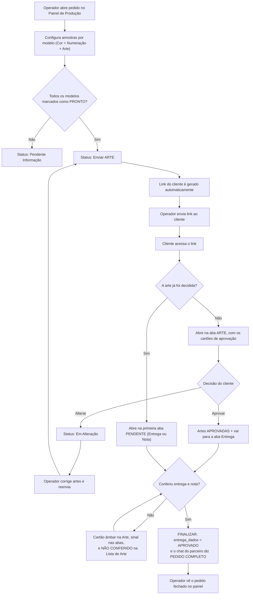
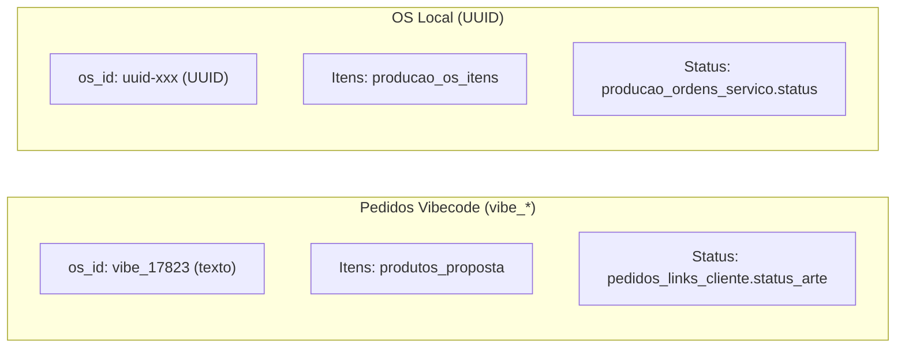

# Fluxo de Aprovação de Arte - Ideal Imposition

Documentação técnica e operacional do fluxo completo de aprovação de artes pelo cliente.

---

## Visão Geral

O sistema permite que o operador da gráfica prepare amostras de arte para cada modelo do pedido e envie um **link público** ao cliente para aprovação. O cliente acessa esse link, visualiza as artes e pode **aprovar** ou **solicitar alteração** em cada modelo.



> [!IMPORTANT]
> **Aprovar a arte NÃO fecha o pedido.** Faltam as duas conferências, e elas são
> a parte que o cliente mais deixa pelo caminho — ver
> *"O cliente que aprova a arte e some"*, mais abaixo.

---

## Tabelas do Banco de Dados (Supabase)

### `pedidos_links_cliente`
Armazena o vínculo entre pedido e link público do cliente.

| Coluna | Tipo | Descrição |
|--------|------|-----------|
| `id` | UUID (PK) | ID único do registro |
| `os_id` | TEXT (UNIQUE) | ID da OS (ex: `vibe_17823`) |
| `numero_pedido` | TEXT | Número visível do pedido (ex: `17823`) |
| `token` | VARCHAR(12) | Token único que compõe a URL |
| `id_int` | TEXT | Número inteiro do pedido (redundância) |
| `status_arte` | TEXT | **Status atual da arte** — controla o que o cliente vê |
| `created_at` | TIMESTAMPTZ | Data de criação do link |
| `acessos` | INTEGER | Contador de acessos do cliente |
| `ultimo_acesso` | TIMESTAMPTZ | Último acesso registrado |
| `ativo` | BOOLEAN | Se o link está ativo (desativável pelo operador) |

> [!IMPORTANT]
> A coluna `status_arte` é a **fonte de verdade** para pedidos Vibecode (`vibe_*`). Para OSs locais (UUID), o status é lido de `producao_ordens_servico`.

### `produtos_proposta`
Itens/modelos do pedido vindos do Vibecode.

| Coluna Relevante | Descrição |
|------------------|-----------|
| `id` | ID numérico do item |
| `id_int` | Número do pedido pai |
| `nome_produto` | Nome do produto (Triband, Mobi, etc.) |
| `modelo_descri` | Formato do modelo |
| `qtd` | Quantidade |
| `amostra_arte_base64` | Arte em base64 (imagem ou PDF) |
| `amostra_cor_id` | ID da cor selecionada |
| `amostra_num_id` | ID da numeração selecionada |
| `amostra_status` | Status individual do item (`PENDENTE`, `PRONTO`, `APROVADA`, `REPROVADA`) |
| `amostra_obs` | Observações/motivo de alteração |

### `propostas_chat`
Log de mensagens do pedido (visível no chat do ERP Vibecode).

> [!WARNING]
> **As sete inserções que o painel faz nesta tabela nunca gravaram nada.** Elas
> mandam a coluna `remetente_nome`, que não existe — a coluna é `autor_nome`, e o
> PostgREST recusa a escrita inteira. Verificado no banco em 19/08/2026: zero
> linhas nossas.
>
> Ficou assim de propósito, à espera de decisão: consertar o nome da coluna, ou
> remover as inserções. Enquanto isso, **não confie neste log** para saber o que o
> cliente disse. A caixa de entrega chegou a exibir uma nota de PIX do Financeiro
> como "solicitação do cliente" por ler daqui — esse plano B foi removido em v647.

---

## Quem manda na Cor e na Numeração do modelo

A linha de `pedidos_modelos` guarda o mesmo fato duas vezes: o **nome**, que o
sistema parceiro escreve (`padrao` e `gabarito_operacional`), e o **id**, que
este painel deriva depois (`amostra_cor_id` e `amostra_num_id`).

Quando os dois discordam, **o nome vence** — ele é a origem. Medido no banco em
12/08/2026: 36 modelos tinham `padrao` sem id e nenhum tinha id sem `padrao`.
Enquanto o id vencia, uma troca de cor feita no ERP depois do primeiro
salvamento nunca mais chegava à tela, nem apertando F5, porque o desencontro
mora na linha do banco e não em cache do navegador.

A regra **não é igual para a numeração**: uma numeração customizada é gravada só
no `amostra_num_id` e deixa o `gabarito_operacional` no gabarito base, então
seguir o texto ali devolveria a numeração de fábrica e apagaria o trabalho do
operador. Os detalhes, os casos de borda e o motivo de cada guarda estão no
cabeçalho de `frontend/cor-numeracao-do-modelo.js`, e os testes em
`tests/CorNumeracaoDoModelo.Tests.ps1`.

A correção acontece ao **carregar o pedido** (`loadOSItens` no painel e o
carregador do `cliente.js` no link), vale em memória, e aparece na tela como um
aviso dizendo o que mudou — trocar cor ou numeração muda o que sai na
impressora, e o operador precisa ver acontecer. O banco se acerta sozinho no
próximo salvamento do modelo.

---

## O Portal do Pedido (20/08/2026)

> [!IMPORTANT]
> **A página do cliente deixou de ser um funil.** Até 20/08/2026 ela só mostrava
> alguma coisa quando o `status_arte` valia `Enviar Arte` ou `Aguard. Aprovação`
> — ou quando o atendente girava o selo de entrega para `ALTERADO`. Medido no
> banco naquele dia: **36 dos 50 links estavam num status em que a página não
> mostrava nada.**
>
> Hoje ela é o **Portal do Pedido**: cinco seções sempre abertas, com barra de
> abas no rodapé, e a aprovação de arte é uma delas. O que o status decide agora
> é só a **cara da aba da arte**.

### As cinco seções

| aba | arquivo | fonte dos dados |
|---|---|---|
| 🎨 Arte | `cliente.js` (`desenharSecaoArte`) | `pedidos_modelos` + catálogos |
| 📦 Entrega | `cliente-entrega.js` | `enderecos`, `propostas`, `propostas_os`, `produtos.prazo`, `cotacao_frete` |
| (logo do frete) | `logo-do-frete.js` | compartilhado com o painel |
| 🧾 Nota | `cliente-faturamento.js` | `clientes` (cinco campos) |
| 💰 Orçamento | `cliente-orcamento.js` | `propostas.texto_whatsapp`, com `produtos_proposta` de reserva |
| 💳 Pagar | `cliente-pagamento.js` | `pagamentos_v2` (uma linha por cobrança) |

O casco — cabeçalho, selo de status, barra de abas, **trilha do pedido**, **sinal
de pendência nas abas** e troca de seção — está em `cliente-shell.js`. Os ícones
desenhados (que substituíram os emoji em 25/08/2026) estão em
`icones-cliente.js`. As duas decisões do cliente (entrega e faturamento) estão em
`cliente-confirmacoes.js`. A carga dos dados e as contas de formatação estão em
`cliente-dados.js`. **O motor de desenho da arte não saiu do `cliente.js`**: onze
arquivos de teste apontam para ele pelo nome, e cinco recortam funções de lá para
executar.

### A trilha do pedido e o sinal nas abas (25/08/2026)

> [!IMPORTANT]
> Das cinco abas, só **três** pedem alguma coisa do cliente: **Arte**, **Entrega**
> e **Nota**. Orçamento e Pagamento são consulta.

Até 25/08/2026 essa distinção não existia na tela: as cinco abas eram idênticas, e
o que faltava só era dito **dentro** de cada uma, no fim da rolagem. Quem abrisse
na aba de Orçamento não tinha como saber que havia duas conferências esperando.

**A trilha** (`desenharTrilha`, `etapasDoPedido`) mora acima das seções e vale para
as cinco: *"Para fechar o pedido — 1 de 3 concluídas"*, com uma barra e as três
etapas. Cada etapa é um **botão que abre a aba dela**, com o piso de toque de 44px
— dizer o que falta sem oferecer o caminho é a metade do trabalho.

| estado da etapa | quando |
|---|---|
| **concluída** (verde, visto) | a arte por `artesJaAprovadas()`; entrega e nota quando a decisão não é `null` |
| **pendente** (âmbar, relógio) | o resto |
| *(contorno)* | a aba aberta — some o azul, fica só o `box-shadow` de `.portal-passo-aqui` |

> **Âmbar desde 03/09/2026, e antes era cinza.** Duas mudanças na mesma linha:
> a cor passou a ser a MESMA do ponto de pendência na barra de abas (eram duas
> línguas para o mesmo estado, na mesma tela), e o azul de "você está aqui"
> saiu — ele vencia o cinza justamente na etapa aberta, que é a que mais precisa
> pedir ação. Onde o cliente está, a barra de abas já diz.

> **Cada etapa também traz o VERBO**, embaixo do nome: *"Entrega / Conferir"*,
> *"Nota / Conferir"*, *"Arte / Aprovada"* (`acao` e `pronto` em
> `etapasDoPedido`). "Entrega" sozinho diz de que a etapa trata, não que ela
> espera alguém.

> **Pedir alteração também conta como decidir.** `false` em `portalConfirmacoes` é
> uma decisão: o pedido do cliente já está registrado e vai ao atendimento. Só
> `null` é "ainda não decidiu".

> **A conta da arte é a MESMA do cartão de finalização** (`artesJaAprovadas`), e
> não uma paralela: duas contas sobre a mesma coisa acabam divergindo, e o cliente
> veria a trilha dizer "concluída" com o botão de finalizar ainda travado.

**O sinal nas abas** (`atualizarSinaisDasAbas`): ponto âmbar quando a aba espera
ação, visto verde quando resolvida, nada quando é só informação — com o estado
repetido em `aria-label`, para quem não enxerga a cor.

> **Pagamento só acende quando há o que fazer ali**: cobrança em aberto **com link
> que abre** (`cobrancas.some(podePagar)`). Pedido faturado, ou cobrança sem link
> liberado, não ganha ponto — sinal de pendência sem botão do outro lado é
> cobrança em cima de quem não pode resolver.

Os dois se redesenham em `abrirSecao`, a cada decisão de arte
(`renderAmostrasOSItens`) e a cada decisão de dados (`decidirDados`,
`desfazerDecisao`), pelo `atualizarPainelDoPedido()`.

### Ícone desenhado, nunca emoji (25/08/2026)

O `cliente.html` guarda só o **nome** de cada ícone (`data-icone="arte"`); o
desenho vem do `icones-cliente.js`, e o `montarPortal` o pinta.

Emoji não é desenho nosso: é uma **fonte do aparelho de quem abre**, e quem abre
este link é o cliente, no celular, pelo navegador embutido do WhatsApp. O 🎨 do
Android tem outra forma, outra paleta e outro peso que o do iPhone — e, por ser
colorido por definição, ele **não acompanha a cor do texto ao lado**: a aba ativa
fica azul e o ícone continua multicolorido.

> **O rótulo em texto continua obrigatório.** Ícone sozinho não diz para onde
> leva. Se o `icones-cliente.js` não carregar, as abas ficam sem desenho e **com**
> o rótulo — e todo chamador testa `typeof iconeCliente === 'function'` antes.

> `icones-cliente.js` está na `PAINEL_ARQUIVOS` do `security_config.py`. Fora
> dela, a estação serviria uma `cliente.html` pedindo um script que dá 404.

### Uma consulta só, pela função do banco

`link_cliente_pedido(p_numero, p_token)` (`sql/link_cliente_pedido.sql`) devolve
num `jsonb` só tudo o que as cinco abas mostram, exigindo o par número+token de um
link ativo. É o mesmo desenho da `link_cliente_abrir`.

Ela substituiu **seis consultas diretas** feitas com a chave anônima — a que está
no código-fonte da página. Uma delas era `select('*')` em `clientes`, que trazia
`limite_credito`, `risco_credito` e `total_compras` junto do nome e do CNPJ que a
tela mostra. Com valores entrando na página (orçamento, frete, total, link de
pagamento), a porta precisava mudar antes do dinheiro.

O arquivo SQL é **aditivo**: ele não revoga privilégio de tabela nenhuma. As
tabelas do parceiro continuam abertas à chave anônima — fechá-las não é decisão
deste projeto e quebraria telas do ERP. O que mudou é que a página pública parou
de usar aquela porta.

### As duas confirmações, e as três chaves

Entrega e faturamento eram um cartão só, com um par de botões e um campo de texto
gravado em `pedidos_artes.observacoes.correcao_entrega_faturamento`. Agora cada
aba tem a sua decisão e a sua chave:

| chave | quem escreve |
|---|---|
| `correcao_entrega` | a aba 📦 Entrega |
| `correcao_faturamento` | a aba 🧾 Nota |
| `correcao_entrega_faturamento` | **ninguém mais** — é a chave dos pedidos já gravados, e continua sendo LIDA |

Não precisou coluna nova: `observacoes` é `jsonb`. O selo continua sendo um só,
`entrega_dados`: as duas confirmadas → `APROVADO`; qualquer uma com correção →
`CORRIGIR`. `ALTERADO` continua nascendo só do atendente, na Lista de Arte.

O painel (`loadDadosEntregaInterno`) mostra as três, e as duas novas vêm
rotuladas — antes o atendente recebia um texto onde os dois assuntos se
misturavam.

### O Prazo de Entrega da aba de Entrega

Desde 25/08/2026 a conta **abre a aba**, num painel próprio (`cartaoDeChegada`):

```
AGORA DEPENDE SÓ DE VOCÊ, SEU PEDIDO PODE CHEGAR EM ATÉ:
7 dias úteis - A contar da aprovação dos Modelos e Confirmação do PAGAMENTO
Entra em produção quando o último modelo do pedido for aprovado
e o pagamento for confirmado.

[ PRODUÇÃO ]     [ TRANSPORTE ]
  5 dias úteis     2 dias úteis

🚚 SEDEX — R$ 148,90
```

Foram duas linhas separadas por algumas horas, em 20/08/2026, até o usuário
apontar que elas obrigavam o cliente a somar de cabeça a resposta que ele foi ali
buscar. A conta ficou certa desde então — o que faltava era o **lugar**: ela saía
como a segunda de sete linhas dentro do cartão de Envio, do mesmo tamanho do
código de rastreio. *"Quando chega?"* é a pergunta que traz o cliente de volta ao
link depois que a arte já foi aprovada.

> [!IMPORTANT]
> **O painel não nasce quando falta número dos dois lados.** Painel grande escrito
> "a combinar" é espaço nobre gasto para não dizer nada — e o cartão de Envio
> abaixo já diz isso. Na **retirada** ele muda de rótulo (*"Pronto para retirada
> em"*) e perde a caixa de transporte: quem vai buscar é o cliente, e somar um dia
> de frete que não vai acontecer daria a ele uma data pior do que a real.

> [!NOTE]
> `linhasDoEnvio` continua devolvendo **tudo** — é a função com teste, e é ela que
> sabe das retiradas, dos prazos sem número e do rastreio. Quem tira as linhas de
> prazo repetidas, quando o painel está aberto, é o `envioSemOsPrazos`, na camada
> de tela. Repetir o mesmo número seis linhas abaixo faz o cliente parar para
> conferir se são dois prazos diferentes.

| parte | origem | regra |
|---|---|---|
| Produção | `produtos.prazo`, pelos itens do pedido | o do produto que demora MAIS: a gráfica só despacha quando o último item fica pronto |
| Envio | `cotacao_frete.prazo` da linha `escolhido` | o que a transportadora prometeu, passado como está |
| Recebimento | a soma dos dois | só quando **os dois** trazem número |

A comparação da produção é feita pelo **número**, e não pelo texto: o catálogo
tem cinco redações para a mesma coisa — "3 dias úteis" (50 produtos), "1 dia
útil" (7), "2 dias úteis" (3), "Prazo de produção 2 dias úteis" e "Produção: 1
dia útil + Frete" (um cada).

O prazo de envio passa **inteiro**, sem reescrita: "A combinar" (1.274 cotações),
"1 dia útil" (227), "Imediato", "Sob consulta", "De 12 até 48hs ( consultar )",
"dia seguinte a conclusão". Reescrever qualquer uma dessas seria inventar uma
promessa de entrega que a gráfica não fez. A única correção é o número solto: 30
cotações do SEDEX gravam só `1`, e outras 227 gravam `1 dia útil` — é a mesma
coisa com a unidade perdida.

> [!IMPORTANT]
> A soma **não sai** quando um dos lados não tem número. "A combinar" não vira
> zero: somar o que der inventaria uma data de entrega que ninguém prometeu, e é
> da data prometida que o cliente cobra depois. Desde 05/09/2026 a redação é
> "em até", com as duas condições no mesmo painel — aprovar os modelos e
> confirmar o pagamento —, porque é disso que o relógio depende (redação dada
> pelo usuário). Na retirada continua "Pronto para retirada em".

> [!NOTE]
> `propostas_os.data_termino` **não aparece** nesta aba. Ela continua sendo o
> Prazo de Entrega do Painel de Produção; o que o cliente vê é a conta acima.

### Qual endereço a aba de Entrega mostra

| caso | endereço mostrado |
|---|---|
| **RETIRADA** (`frete_escolhido` ou `cotacao_frete.servico` começando por RETIR) | o da **gráfica**, lido de `empresas` (empresa 1), com botão de rota no mapa |
| pedido com `propostas.id_endereco_ent` | o endereço **escolhido no pedido** — um cliente pode ter vários |
| sem escolha no pedido | o endereço **principal** do cadastro, marcado como tal na tela |
| sem escolha e sem principal | o único endereço, se houver um só |

Medido em 20/08/2026: **2.024 dos 4.001** pedidos dos últimos 90 dias estão com
`id_endereco_ent` vazio — sem esta regra, metade dos pedidos não mostrava
endereço nenhum. E ela não deixa empate: dos 1.218 clientes desses pedidos,
**1.217 têm exatamente um endereço principal**, nenhum tem dois, e o único sem
principal tem um endereço só.

A comparação é `upper(btrim(coalesce(tipo_endereco, '')))`: a coluna vem do ERP
com as duas grafias, "principal" e "Principal".

Na retirada, duas coisas mudam junto: a linha de prazo mostra **só a produção**
("Pronto para retirada a partir de X"), porque não há perna de envio a somar; e o
recebedor deixa de ser exigido, porque quem busca é o próprio cliente, no balcão.

O endereço da gráfica é lido do cadastro do ERP, e não escrito no código: se ela
mudar de endereço, a página acompanha.

---

### O recebedor: quando ele é herdado e quando é obrigatório

**Recebedor** e **CPF do recebedor** são as duas primeiras linhas do cartão de
endereço, e aparecem SEMPRE. O motivo está no banco: só **126 dos 1.929**
endereços de pedidos dos últimos 90 dias têm `recebedor`, e 132 têm
`cpf_recebedor`. Escondendo a linha vazia — que era o comportamento até
20/08/2026 —, 93% dos clientes nunca ficaram sabendo que faltava esse dado, e
quem descobria era o motoboy, na portaria do prédio.

Faltando o dado, a regra do usuário (20/08/2026) decide o que acontece:

| nota fiscal | recebedor vazio no endereço |
|---|---|
| **CPF** (pessoa física) | herda o nome e o CPF da nota, com a etiqueta "mesmo da nota fiscal" |
| **CNPJ** (pessoa jurídica) | fica "Não informado", e o CONFIRMAR é **desligado** |
| documento desconhecido | trata como CNPJ — não dá para herdar o que não se sabe |

O porquê está na entrega: a transportadora põe o pacote na mão de uma pessoa e
pede o CPF dela. Numa nota de pessoa física essa pessoa é o próprio cliente, e o
dado já está no cadastro; numa nota de empresa não há a quem herdar.

**O tipo sai da contagem de dígitos** (`tipoDaPessoa`), e não da coluna
`tipo_pessoa`. Medido nos 3.946 clientes com pedido nos últimos 90 dias:
`tipo_pessoa` usa dois vocabulários — "CPF"/"CNPJ" em 3.153 e "FISICA"/"JURIDICA"
em 793 —, enquanto os dígitos nunca discordaram: 11 para CPF, 14 para CNPJ.

**O que está escrito no endereço vence sempre**: quem cadastrou "Maria, da
portaria" sabe mais do que esta regra.

> [!IMPORTANT]
> **A saída fica na própria linha do problema.** Desde 25/08/2026 o aviso de
> recebedor faltando é uma linha com o botão **Informar** ao lado
> (`portal-falta`), que chama o mesmo `decidirDados('entrega', false)` do Alterar.
> Antes ele dizia *"toque em ALTERAR abaixo"* — e o Alterar fica noutro cartão,
> depois de sete linhas de endereço.

> **A trava tem saída, e é o Alterar.** Com CNPJ e sem recebedor, o Confirmar
> fica desligado — o cliente não pode dizer "está correto" sobre um endereço que
> a transportadora não consegue entregar. Mas a caixa de texto do ALTERAR passa a
> pedir o nome e o CPF, e quem a usa deixa de ser cobrado no cartão de
> finalização: o pedido segue ao atendimento com a solicitação. Sem isso, o
> cliente ficaria preso na página sem caminho para terminar.

---

### O pagamento: onde o link mora

Em **`pagamentos_v2.url_cobranca`**, e a forma em `tipo_cobranca`. Achado no
banco em 20/08/2026 a partir do pedido 20927, cujo link é
`https://pay.ai-ideal.com.br/i/a21f550f`.

> [!WARNING]
> `propostas_os.link_pagamento`, que a v656 lia, **está vazio nas 23 linhas**
> daquela tabela. Nunca foi por ali. Em `pagamentos_v2` são 3.552 pedidos com
> cobrança nos últimos 90 dias.

A aba mostra uma **lista** de cobranças, porque 190 desses pedidos têm duas ou
mais — entrada mais parcelas, com a referência indo `20927-A`, `20927-B`. A
**em aberto vem à frente**, e a paga fica recolhida: o que o cliente veio fazer
aqui é pagar o que falta.

### Um painel só, e o número grande é o que FALTA (25/08/2026)

Até 25/08/2026 a aba abria com **duas** caixas de destaque empilhadas — *"Status
do pagamento"* e *"Total do pedido"* —, e o total já era o mesmo número que a aba
de Orçamento mostra em destaque. Duas caixas do mesmo tamanho, uma repetindo outra
aba, e nenhuma respondendo o que o cliente vem perguntar aqui: **quanto eu ainda
devo?**

```
FALTA PAGAR                    [ Parcialmente pago (1 de 2) ]
R$ 3.420,00
▓▓▓▓▓▓▓▓░░░░░░░░░░░░
R$ 2.280,00 pagos                       Total R$ 5.700,00
```

> [!IMPORTANT]
> **A conta sai das COBRANÇAS, e não de `propostas.valor_total`.** São números
> diferentes quando o pedido foi cobrado com entrada mais parcelas, ou quando o
> financeiro cancelou uma e emitiu outra: dizer *"falta R$ 5.700"* a quem já pagou
> a entrada seria cobrá-lo duas vezes na tela. Quem faz a conta é
> `contasDoPagamento`, com a mesma regra de pago/cancelada do
> `pagamento-do-pedido.js`.

> **Pedido sem cobrança não entra nessa conta:** ali o painel mostra o valor do
> pedido, porque *"falta R$ 0,00"* se lê como "está pago" — e são 350 dos pedidos
> da Lista de Arte, onde a cobrança apenas ainda não saiu.

> **A barra some quando os valores não vieram.** Uma barra que anda por engano diz
> uma mentira sobre dinheiro; aí a legenda conta **cobranças** ("1 de 2 pagas").

O **status em destaque** é o das cobranças todas juntas, e não o de uma:

| situação | o que aparece |
|---|---|
| todas pagas | Pago |
| algumas pagas | Parcialmente pago (N de M) |
| nenhuma paga | Aguardando pagamento |
| sem cobrança | Aguardando cobrança |

Duas guardas no botão "Pagar agora": cobrança **cancelada** não sai da função do
banco (o link dela ainda abre, e mandar pagar o que a gráfica cancelou é pior do
que não mostrar nada), e cobrança **paga** não ganha botão (é convite para pagar
duas vezes).

`pix_copia_cola`, `linha_digitavel` e os dados de cartão não saem da função: ela
entrega o endereço da cobrança, e o gateway mostra o resto.

---

### O que o Orçamento mostra, e por quê

`propostas.texto_whatsapp` — o resumo que o ERP monta e o vendedor manda ao fechar
o pedido. Preenchido em 1.436 dos 1.489 pedidos dos últimos 30 dias.

Remontar o orçamento a partir de `produtos_proposta` daria uma **segunda versão do
mesmo número**, e duas versões do mesmo preço na frente do cliente é o que uma
página de gráfica não pode fazer. Só nos 4% sem resumo é que a lista é montada
pelos itens.

O `*negrito*` do WhatsApp vira `<b>` **depois** de o texto ser escapado: ele vem do
banco do parceiro e vai para dentro de `innerHTML`.

---

## Status da Arte e o que o cliente vê

O status vive em `pedidos_links_cliente.status_arte`, que é **texto livre** e foi
escrito por três telas ao longo de um ano. As grafias que existem de verdade no
banco, lidas em 20/08/2026 nos 50 links:

| status_arte | links | selo no cabeçalho | a aba da arte mostra |
|---|---|---|---|
| `EM PRODUCAO` | 29 | Pedido em produção | as artes aprovadas, só leitura |
| `APROVADO` | 7 | Artes aprovadas | as artes aprovadas, só leitura |
| `Em Arte` | 5 | Arte em preparação | a mensagem de preparação |
| (nulo) | 5 | Arte em preparação | a mensagem de preparação |
| `Enviar Arte` | 2 | Aguardando sua aprovação | a aprovação, com os botões |
| `Aguard. Aprovação` | 2 | Aguardando sua aprovação | a aprovação, com os botões |

A documentação antiga citava `ARTE_APROVADA`, `ARTE_EM_CORRECAO`,
`ARTE_EM_ANDAMENTO` e `Enviar ARTE` — grafias que o código antigo escrevia e que
**não existem mais no banco**. Elas continuam sendo entendidas: quem traduz é
`seloDoStatus`, no `cliente-shell.js`, que compara sem acento e por trecho, e tem
teste para as seis grafias. Um status novo que o ERP invente cai em "Arte em
preparação" — nunca numa tela em branco.

> [!NOTE]
> As **outras quatro abas abrem em qualquer status**. O status decide só a aba da
> arte. Era o contrário até 20/08/2026: o status decidia se a página inteira
> mostrava alguma coisa.

---

## O que o cliente vê enquanto aprova (25/08/2026)

Conferido no navegador, num iPhone simulado, dirigindo o fluxo de ponta a ponta
nos pedidos 21114 (3 modelos) e 21143 (7 modelos).

| Estado | Barra do rodapé |
|---|---|
| Nenhum aprovado | *Faltam **3 modelos** para decidir. Role a página e toque em **Aprovar** ou **Pedir alteração** em cada um.* + botão cinza |
| Alguns aprovados | o mesmo, com a conta atualizada (*Falta **1 modelo***) |
| **Todos aprovados** | *✅ **Todas as artes aprovadas.** Levando você para os dados de entrega...* e a página **vira sozinha** |
| Algum em alteração | botão laranja **Enviar pedidos de alteração** — sem salto |

> Os rótulos saíram da caixa alta em 25/08/2026, e o botão verde passou a ser
> **Aprovar artes e continuar**: *"FINALIZAR E APROVAR PEDIDO COMPLETO"* dizia só
> metade do que o toque faz, e em caixa alta soava como o fim do caminho — quando
> ainda faltam a conferência da entrega e a da nota, que é para onde ele leva.

### A ordem do cartão: a arte primeiro (25/08/2026)

O cartão de cada modelo abria com os botões **APROVAR** / **ALTERAR** e com uma
caixa de texto rotulada *"Anotações / Observações de Alteração"*; a arte vinha
**depois**. Lendo de cima para baixo — que é como se lê um celular — o cliente era
convidado a decidir antes de ver o que estava decidindo, e a caixa aberta sugeria
que escrever nela fazia parte de aprovar. O rótulo, ainda por cima, é vocabulário
do painel interno.

Hoje o cartão do cliente sai de um ramo próprio (`if (ehCliente)` em
`renderAmostrasOSItens`), nesta ordem:

```
Nome do modelo                    [ chip de estado ]
─────────────────────────────────────────────────
            a ARTE (frente, verso, PDF)
                          [ 🔍 Ampliar ]
[ produto ] [ 180 un ] [ frente e verso ]

[  ✓ Aprovar  ]  [  ✎ Pedir alteração  ]
```

> [!IMPORTANT]
> **A caixa de alteração nasce fechada** e abre no toque de *Pedir alteração*
> (`abrirPedidoDeAlteracao`), com o botão *Enviar pedido de alteração* dentro
> dela. Mas o `<textarea>` **continua no HTML mesmo fechado**, com o mesmo id: é
> dele que o `decisionAmostraItem` lê, e é ele que recusa `REPROVADA` sem
> descrição. Sem o campo na página, a recusa cairia num `focus()` de elemento
> inexistente e o cliente ficaria com o aviso e nenhum lugar para escrever.
>
> O `display` vai no `style=""`, e não numa classe: regra de folha de estilo perde
> para atributo `style`, e nesta mesma tela um `hidden` já deixou de esconder dois
> botões por causa disso.

> **O par continua com o mesmo peso visual dos dois lados.** Pintar o Aprovar de
> verde e o outro de cinza empurra o cliente a aprovar sem olhar — e é exatamente
> aqui que ele deveria olhar. A cor entra **depois** da decisão, para dizer o que
> ele escolheu.

> **O convite a ampliar** (`amostra-ampliar`) existe porque o toque na arte sempre
> abriu o lightbox e nada dizia isso: imagem não anuncia que é clicável, e
> `cursor: zoom-in` não existe no celular. Ele tem `pointer-events: none`, para o
> toque atravessar o chip e chegar na arte, que é quem tem o `onclick`.

### O contador

Até 25/08/2026 não existia. O cliente de um pedido de sete modelos aprovava
quatro, rolava até o fim e encontrava um botão cinza morto, sem uma palavra
explicando por quê — medido na tela: nenhum contador na aba, e o único texto da
barra era o rótulo do próprio botão. Ele não tinha como saber se faltava rolar de
volta ou se o sistema tinha travado.

As abas de Entrega e Nota sempre disseram o que falta ("Para finalizar, falta:
..."). A da arte era a única trava do portal sem a saída escrita ao lado.

### O salto automático

Pedido do usuário no mesmo dia: *"ao aprovar todas, deve automaticamente passar a
página seguinte"*. Quem faz é `seguirSozinhoSeAprovouTudo(osId)`, no `cliente.js`.
Ela mostra o aviso, espera 1,2 s e chama o mesmo `clienteFinalizarFluxo('APROVAR_TUDO')`
que o botão sempre chamou.

> [!CAUTION]
> **O salto nasce de um CLIQUE, e nunca da carga da página.** A função é chamada
> de dentro do `decisionAmostraItem`, no ramo do cliente — não do
> `atualizarBarraFinalCliente`, que também roda ao abrir.
>
> Existem pedidos com todos os modelos já em `APROVADA_CLIENTE` e status ainda em
> `Aguard. Aprovação` — o 21112 é um deles. Se o avanço fosse decidido pelo
> **estado**, esse cliente abriria o link e seria empurrado para a aba de Entrega
> antes de ver a arte, e o pedido gravaria aprovação e mensagem no chat do
> parceiro sem ele ter tocado em nada. Conferido: abrir esse link não dispara
> escrita nenhuma.

Dois detalhes que só aparecem na tela:

- **A trava é uma bandeira (`state.arteSeguindoSozinho`), não uma corrida com o
  relógio.** O `renderAmostrasOSItens` agenda o `atualizarBarraFinalCliente` para
  dali a 50 ms; sem a bandeira, o botão verde FINALIZAR piscaria por um segundo
  no meio do caminho — justamente o botão que este recurso existe para o cliente
  não precisar procurar.
- **Na última arte o toast "Item aprovado!" some.** Ele nasce no rodapé, onde a
  barra fica, e tapava a frase que explica para onde a tela está indo.

A pausa de 1,2 s é de propósito: o card acabou de ficar verde, e trocar a tela no
mesmo instante faria o cliente perder de vista a própria ação.

---

## O cliente que aprova a arte e some (03/09/2026)

Medido no banco em 03/09/2026, nos 88 links ativos:

| | |
|---|---|
| pedidos com a arte já decidida e a conferência de dados **nunca feita** | **17** |
| desses, que abriram o link **2 vezes ou mais** | **14** (um deles 50 vezes) |
| taxa desde que o Portal existe | **6 de 14 — 43%** |
| links que já pediram correção de dados (`entrega_dados = CORRIGIR`) | **0 de 88** |

Não foi falta de oportunidade. O motivo estava na tela:

- **O link abria sempre na aba da Arte.** `montarPortal` só respeitava um `#hash`,
  e o link colado no WhatsApp não tem hash.
- **A primeira dobra dava tranquilidade.** Para quem já aprovou, o cartão maior
  dizia *"Pedido em produção — suas artes já estão na impressora"*. O que pedia
  ação eram dois chips cinza e dois pontos âmbar de 9px no rodapé.
- **A saída era uma frase, não um botão.** *"Confira o prazo e o endereço na aba
  Entrega"* não tem alvo de toque.

Endereço errado é frete de volta; CNPJ errado é nota refeita. Os dois só se
descobrem depois de o material estar impresso.

### O que mudou

| # | onde | o quê |
|---|---|---|
| 1 | `cartaoDoQueFaltaNaArte` (`cliente.js`) | cartão **âmbar** no topo da aba da Arte, ACIMA do cartão de status, com o botão até a aba pendente |
| 2 | `secaoDeAbertura` (`cliente-shell.js`) | o link abre na primeira aba pendente, e a página **avisa** que abriu sozinha, com *"Ver minha arte"* ao lado |
| 3 | `desenharTrilha` + `.portal-passo-pendente` | pendente em âmbar, com o verbo da etapa |
| 4 | `botaoDeContinuarNaArte` | *"Continuar: conferir entrega"* no FIM da aba da Arte |
| 5 | `mensagemDaAprovacaoDeArte` | o chat do parceiro para de dizer "PEDIDO COMPLETO" quando só a arte foi aprovada |
| 6 | coluna Entrega/Faturamento da Lista de Arte (`script.js`) | o `----` de um pedido com a arte **já decidida** vira ⚠️ NÃO CONFERIDO |
| 7 | `.cliente-header` / `.portal-trilha` | cabeçalho apertado de 178px para 163px |

> [!CAUTION]
> **A abertura automática decide pelo STATUS, nunca pela contagem de modelos.**
> É a mesma armadilha que o `seguirSozinhoSeAprovouTudo` documenta logo acima:
> existem pedidos com todos os modelos em `APROVADA` cujo status continua em
> `Aguard. Aprovação`, e decidir pela contagem levaria o cliente para longe da
> arte antes de ele tê-la visto. A regra aqui é mais estreita do que a de lá —
> só `chave === 'aprovado' || chave === 'producao'`.
>
> A diferença que torna isto seguro: **trocar de aba não aprova nada**. O salto
> automático de `seguirSozinhoSeAprovouTudo` grava; este só muda o que está
> visível.

> **O alarme não acende sem link do cliente.** Sem linha em `pedidos_artes`
> nunca houve link, é pedido que a gráfica tocou por dentro, e cobrar dele uma
> conferência que ninguém pediu seria alarme falso na tela inteira. Quem cria a
> linha é o painel, ao gerar o link (`garantirLinhaDePedidoArte`).

> [!IMPORTANT]
> **Ele mora na Lista de Arte, e em lugar nenhum além dela.** Um marcador igual
> chegou a entrar na linha do Painel de Produção em 03/09/2026 e saiu no mesmo
> dia, a pedido do usuário. Dois motivos, e o segundo é o que decide: ali ele
> era **só leitura**, empilhado como terceira linha embaixo do nome do cliente
> numa tabela que já é larga; na Lista de Arte o mesmo selo **se clica** para
> mudar de estado, ao lado do `----`, do APROVADO e do CORRIGIR, que já viviam
> naquela coluna. Aviso que não pode ser resolvido onde aparece vira ruído — é
> a mesma régua de `trava-precisa-ter-saida`.
>
> O Painel do Acabamento nunca teve o marcador. A verificação negativa está no
> `portal_pendencia_harness.js`: é o tipo de aviso que parece óbvio de
> re-adicionar meses depois, olhando só para os 17 pedidos que foram para a
> produção sem conferência.

> **`.portal-pendencia`, e não `.portal-falta`.** A segunda já existe e pertence
> ao cartão EM LINHA da aba de Entrega (`display: flex`). O cartão novo chegou a
> nascer com ela e saiu com título, texto e botão lado a lado, cada um numa
> coluna estreita. Está travado em `tests/test_portal_pendencia.py`.

Os testes estão em `tests/portal_pendencia_harness.js` (45 verificações, lendo o
código de produção) e `tests/test_portal_pendencia.py`.

---

## Fluxo Detalhado — Passo a Passo

### 1. Preparação pelo Operador (Painel Interno)

1. Operador abre o pedido no **Painel da Produção**
2. Clica no pedido para expandir os detalhes → aba **Amostras**
3. Para cada modelo (item) do pedido:
   - Seleciona **Cor Cadastrada** (dropdown com cores do formato)
   - Seleciona **Numeração Cadastrada** (dropdown filtrado pela cor)
   - Faz **Upload da Arte** (PDF, JPG ou PNG)
   - A visualização combinada é renderizada em tempo real no canvas
4. Marca cada modelo como **🎨 PRONTO** (botão na decisão de qualidade)

> [!IMPORTANT]
> Desde 19/08/2026, marcar PRONTO **gera e salva a arte de amostra de novo**. Antes
> ela ficava com a versão anterior depois de uma correção, e era essa versão velha
> que o cliente via. Se a geração falhar, o modelo **não** é marcado como pronto e
> o operador é avisado — mandar link com arte velha é pior do que não mandar.
>
> Marcar PRONTO também exige que a **Qtd do modelo bata com as células geradas**
> (igual à Qtd na frente, o dobro em Frente × Verso). Divergiu, o pedido não anda
> até alguém corrigir as linhas da numeração. A `Qtd` nunca é escrita de volta no
> banco: ela é a quantidade contratada.

### 2. Envio ao Cliente

5. Clica em **"Voltar para Atendimento"**
6. O sistema verifica se **todos** os modelos estão com `amostra_status === 'PRONTO'`
   - **Sim** → status muda para `Enviar ARTE`, link é gerado automaticamente e copiado para a área de transferência
   - **Não** → status muda para `Pendente Informação`, alerta ao operador
7. O link gerado tem formato: `https://dominio.com/cliente/{numero}-{token}` (ex: `/cliente/17823-zi1v27`)

### 3. Acesso pelo Cliente

8. Cliente acessa o link no navegador
9. Função `checkClienteRoute()` detecta a rota `/cliente/{numero}-{token}`
10. Função `initClientePage(numero, token)` executa:
    - Valida token na tabela `pedidos_links_cliente` (busca por `numero_pedido`, `token`, `ativo=true`)
    - Incrementa contador de `acessos`
    - Carrega dados do cliente de `propostas`
    - Carrega formatos, cores e numerações para renderização
    - **Carrega itens** de `produtos_proposta` (mapeados via `mapVibecodeProdutoToOSItem`)
    - Mescla dados de `pedidos_artes` (se houver PDFs e versões)
    - **Lê o status** de `pedidos_links_cliente.status_arte`
    - Executa o `switch(osStatus)` que decide o que mostrar

### 4. Aprovação pelo Cliente

11. Se status = `Enviar ARTE`: cliente vê, por modelo:
    - Canvas renderizado com a arte combinada (cor + numeração + arte), **acima**
      da decisão
    - Botões **Aprovar** e **Pedir alteração**, com o mesmo peso visual
    - A caixa de alteração, **fechada**, que abre no toque de *Pedir alteração*
    - Botão global **Aprovar artes e continuar** (cinza enquanto falta decidir
      algum modelo, com o recado dizendo quantos)

12. **Se Aprovar** (`clienteFinalizarFluxo('APROVAR_TUDO')`):
    - Status global → `ARTE_APROVADA`
    - Cada item → `amostra_status: 'APROVADA_CLIENTE'`
    - Log no chat: "PEDIDO COMPLETO APROVADO PELO CLIENTE"
    - Tela de sucesso: "Pedido Aprovado com Sucesso!"

> [!NOTE]
> **Quem aprovou fica registrado no próprio valor**, e não numa coluna nova:
> `APROVADA_CLIENTE` é o botão APROVAR do link do cliente; `APROVADA` é o ✅
> APROVADO do painel, apertado pelo atendente. O aviso do modelo travado diz qual
> dos dois foi.
>
> Os dois valores já eram lidos como aprovado em todo o código — nas listas de
> aprovado, no mapa de selos e no remapeamento da carga —, então não é vocabulário
> novo para o sistema parceiro.
>
> O link do cliente **não** passa pelo `script.js`: `cliente.js` tem o próprio
> `saveAmostraToDB`, e `cliente.html` não carrega o arquivo do painel.

13. **Se Solicitar Alteração** (`clienteFinalizarFluxo('SOLICITAR_ALTERACAO')`):
    - Status global → `ARTE_EM_CORRECAO`
    - Log no chat com observações de cada modelo reprovado
    - Tela: "Alteração Solicitada!"

### 4b. A alteração dos dados de nota fiscal e entrega

Depois das artes, o cliente confere **os dados de faturamento e o endereço de
entrega**. São dois botões — CONFIRMAR e ALTERAR — e, no ALTERAR, um único campo
de texto: *"Informe aqui quais dados de faturamento e/ou endereço de entrega
precisam ser corrigidos"*.

Esse texto mora em **`pedidos_artes.observacoes.correcao_entrega_faturamento`**,
tabela nossa, e é o que o painel mostra dentro do pedido, na caixa "Dados de
Entrega / Faturamento Alterados" (`loadDadosEntregaInterno`). Não havendo texto,
o painel cai numa frase genérica — e é assim que se percebe que a gravação
falhou.

> [!CAUTION]
> **A linha do pedido em `pedidos_artes` precisa existir ANTES de o link ir ao
> cliente.** A tela do cliente roda como `anon` (o link não tem sessão do
> Supabase) e a RLS recusa INSERT ali — `42501, new row violates row-level
> security policy`. Ler e atualizar, ela pode; criar, não.
>
> Até 20/08/2026 ninguém criava essa linha no caminho do cliente: havia 38 linhas
> para 8.263 propostas, porque ela só nascia no briefing do painel. E como a
> gravação era um `.update()` solto, o texto ia embora **calado** — um UPDATE que
> não acha linha nenhuma responde `200` com `[]`, sem erro, e o `supabase-js` não
> lança.
>
> Hoje quem cria a linha é `garantirLinhaDePedidoArte`, chamada por
> `getOrCreateLinkCliente` — no painel, com usuário logado, no momento em que o
> pedido vai para o cliente. Quem grava do lado do cliente é
> `gravarCorrecaoDoCliente`, que pede as linhas afetadas de volta e **devolve o
> resultado**; se não gravou, o cliente vê um aviso com o número do pedido em vez
> de "Pedido Aprovado com Sucesso".

O botão **💾 Salvar Correção** grava na hora. Quem decide o `entrega_dados`
(`CORRIGIR` ou `APROVADO`) continua sendo o botão final da página — por isso
`gravarCorrecaoDoCliente` aceita status nulo, que grava o texto sem mexer no
estado do pedido.

O `entrega_dados` tem um quarto valor, `ALTERADO`, que **não vem do cliente**:
ele só nasce do atendente girando o selo na Lista de Arte
(`alterarEntregaDadosStatus`, que cicla APROVADO → ALTERADO → CORRIGIR → ----).
Um pedido em `ALTERADO` sem texto do cliente é isso, e não uma gravação perdida.

### 5. Retorno ao Operador

14. Operador vê a mudança de status no painel (badge atualizado)
15. Se foi alteração: operador corrige artes, marca PRONTO novamente, e clica "Voltar para Atendimento" → ciclo recomeça

---

## Ações em lote no pedido (22/08/2026)

> Pedido do usuário: *"Cria um botão (ação) dentro do pedido para Marcar Pronto, Reprovar e
> Aprovar simultaneamente todos os modelos do mesmo pedido, respeitando que aprovação e
> reprovação somente usuário ADM e Atendimento"*.

**Onde.** No banner do pedido aberto (tela Amostras, `#amostras-os-banner`), a linha
**"Todos os modelos:"** (container `#amostras-acoes-em-lote`) com até três botões:

| Botão | O que faz em cada modelo | Quem vê |
|---|---|---|
| 🎨 Marcar todos PRONTO | o mesmo que "Arte Pronta" do card | todo mundo que abre o pedido |
| ❌ Todos em ALTERAÇÃO | o mesmo que "Em Alteração" do card | **só ADM e Atendimento** |
| ✅ Aprovar todos | o mesmo que "✅ APROVADO" do card | **só ADM e Atendimento** |

Quem não é ADM/Atendimento vê, no lugar dos dois botões, o texto *"Aprovar e colocar em alteração
em lote: só ADM e Atendimento"*. No link do cliente a linha não existe.

**Como funciona.** O botão em lote faz **exatamente** o que o botão do card faz, modelo a modelo:
a mesma `decisionAmostraItem(itemId, osId, status, { emLote: true, obs })`, com as mesmas travas
(Qtd × linhas do banco, elemento de banco sem CSV ou coluna, modelo aprovado pelo cliente), a
mesma arte de aprovação regerada no PRONTO e o mesmo "Enviar Arte" automático quando todos os
modelos ficam PRONTO (`promoverPedidoSeTodosProntos`, chamada uma vez no fim). Nada novo é
escrito no banco.

Antes de agir aparece um **plano**: quantos modelos entram e quem fica de fora, com o motivo —
"já está pronto", "aprovado pelo cliente — não se altera", a divergência de células ou o banco
incompleto (PRONTO); "já está aprovado" (Aprovar); "já está em alteração" ou "aprovado — só o
atendimento, o gerente ou o administrador devolvem para alteração" (Em Alteração). O operador
confirma ou desiste. **Todos em ALTERAÇÃO** pede antes uma anotação única, obrigatória, que vai
para os modelos sem anotação e é **acrescentada** nos que já têm. Os modelos são processados em
sequência, e no fim há um único recarregamento e um único aviso com o resumo (feitos, de fora,
falhas).

**Funções** (`frontend/script.js`, ao lado das regras de bloqueio): `podeAgirEmLoteNoPedido(acao)`
(quem pode: PRONTO qualquer papel; APROVADA e REPROVADA só `admin` e `atendimento`, pela sessão do
site ou pelo acesso local da estação), `planoDaAcaoEmLote(itens, acao, ctx)` e
`textoDoPlanoEmLote(plano, total)` (puras), `nomeDoModeloParaLista(item)`, o executor
`window.acaoEmLoteNoPedido(osId, acao)` e o desenho `renderAcoesEmLoteDoPedido(osId)`, chamado por
`renderAmostrasOSItens`.

**Testes.** `tests/acao_em_lote_harness.js` lê as funções do `script.js` e exercita papéis ×
ações, cada motivo de pular, o texto do plano e o nome do modelo; `tests/test_acao_em_lote.py` roda
o harness e confere a ligação (container no HTML, assinatura nova, promoção nos dois caminhos,
botões atrás de `podeAgirEmLoteNoPedido`).

---

## Arquitetura de Dados — Pedidos Vibecode vs. OS Local



> [!NOTE]
> As tabelas `producao_ordens_servico` e `producao_os_itens` usam **UUID** como tipo de ID. Pedidos do Vibecode usam IDs no formato `vibe_{numero}` (texto). Por isso, para pedidos Vibecode, o sistema usa rotas alternativas:
> - **Itens**: `produtos_proposta` (via `id_int`)
> - **Status**: `pedidos_links_cliente.status_arte` (via `os_id`)

---

## Funções Principais (script.js)

### Painel do Operador

| Função | Linha | Descrição |
|--------|-------|-----------|
| [renderAmostrasOSItens](../frontend/script.js#L12570) | ~12570 | Renderiza as janelas de cada modelo com dropdowns de cor/num, upload de arte, botões de decisão |
| [renderItemAmostraCombinada](../frontend/script.js#L13110) | ~13110 | Desenha a visualização combinada (cor + numeração + arte) no canvas |
| [voltarParaAtendimento](../frontend/script.js#L12815) | ~12815 | Verifica se todos os modelos estão PRONTO, atualiza status e gera link |
| [changeOSStatus](../frontend/script.js#L12099) | ~12099 | Altera status da OS (localStorage + Supabase) |
| [getOrCreateLinkCliente](../frontend/script.js#L13944) | ~13944 | Busca ou cria o link do cliente na tabela `pedidos_links_cliente` |
| [gerarLinkCliente](../frontend/script.js#L13989) | ~13989 | Wrapper que gera link, copia para clipboard e exibe toast |
| [saveAmostraToDB](../frontend/script.js#L13030) | ~13030 | Salva dados de amostra (cor, numeração, arte, status) no banco |

### Página do Cliente

Ela saiu do `script.js` faz tempo, e desde 20/08/2026 mora em sete arquivos, que a
`cliente.html` carrega nesta ordem (a ordem importa: `cliente-shell.js` precisa
existir antes das abas, que se registram ao serem lidas).

| arquivo | o que contém |
|---|---|
| `cliente-dados.js` | `carregarPortal` (a RPC), `emReal`, `rotuloDoFrete`, `prazoDeProducao`, `prazoDoFrete`, `enderecoEmLinhas`, `linkDeRastreio` |
| `cliente-shell.js` | `seloDoStatus`, `abrirSecao`, `registrarSecao`, `redesenharSecao`, `montarPortal` |
| `cliente-confirmacoes.js` | `cartaoDeDecisao`, `cartaoDeFinalizacao`, `decidirDados`, `salvarCorrecaoDeDados`, `finalizarNoPortal` |
| `cliente-entrega.js` | `desenharSecaoEntrega`, `linhasDoEnvio`, `cartaoDeLinhas` |
| `cliente-faturamento.js` | `desenharSecaoFaturamento`, `linhasDoFaturamento` |
| `cliente-orcamento.js` | `desenharSecaoOrcamento`, `negritoDoWhatsapp`, `resumoLimpo`, `linhasDoOrcamento` |
| `cliente-pagamento.js` | `desenharSecaoPagamento`, `estadoDoPagamento`, `mostraStatusDePagamento` |
| `cliente.js` | a rota (`checkClienteRoute`), a carga (`initClientePage`), a gravação (`gravarStatusDoLink`, `gravarCorrecaoDoCliente`, `saveAmostraToDB`), o fluxo de aprovação (`clienteFinalizarFluxo`) e **o motor de desenho da arte inteiro** |

> [!NOTE]
> O motor de desenho ficou onde estava de propósito. Onze arquivos de teste
> apontam para `frontend/cliente.js` pelo nome, e cinco recortam funções de lá
> para executar (`drawAmostraFace`, `saveAmostraToDB`, `gravarCorrecaoDoCliente`,
> `ehArquivoPdf`, o cálculo de `previaUtil`). Mover obrigaria a religar os onze e
> arriscaria a composição da peça, que está aprovada e rodando na gráfica — em
> troca de arrumação que o cliente não vê.
>
> Os testes que leem "o código da página do cliente" leem **todos** os
> `frontend/cliente*.js` juntos, para que uma regra que mude de arquivo continue
> sendo vista.

---

## O viewer de PDF multipáginas do link do cliente

Item em **modo PDF** não usa o canvas de composição (`#amostra-item-canvas-N`): ele tem
um viewer próprio, com `#amostra-pdf-canvas-N` e os botões ◀ ▶. Três coisas a saber
antes de mexer, todas aprendidas na v507:

**1. Existe um único ponto de entrada, e tem que continuar assim.**
`renderAmostrasOSItens()` agenda o desenho dos itens aos 50 ms; para item em modo PDF,
o caminho é `renderItemAmostraCombinada` → `drawAmostraFace` → `initPdfViewer`. Até a
v506 havia um **segundo** laço, aos 200 ms, chamando `initPdfViewer` de novo para os
mesmos itens, sem guarda nenhuma. Não acrescente outro: a condição do laço dos 50 ms já
inclui `item.modo_pdf`, e o painel interno (`script.js`) sempre viveu com um caminho só.

**2. Dois `page.render()` no mesmo canvas se corrompem, e o erro é silencioso.**
`desenharPaginaDoPdf()` começa reatribuindo `canvas.width`/`height`, o que zera o canvas
**e a transformação** que o pdf.js aplicou ao contexto. Fazer isso durante outro desenho
produz `Cannot use the same canvas during multiple render() operations`, que o `catch`
transforma num `console.error`. O que sobra na tela é a página em escala errada e
espelhada — foi exatamente o sintoma da v507. Por isso `renderPdfViewerPage()` hoje é só
um enfileirador: ele encadeia os desenhos por item e delega a `desenharPaginaDoPdf()`.

**3. A fila mora fora do `pdfViewerState`, de propósito.**
`initPdfViewer` **substitui** `pdfViewerState[idx]` por um objeto novo. Uma fila guardada
dentro dele nasceria vazia a cada inicialização e não serializaria justamente as duas
chamadas que se atropelam. Ela vive no mapa `pdfRenderQueue`, à parte. Se algum dia essa
fila for movida para dentro do estado, o bug da v507 volta.

Como a corrupção depende de como os downloads se intercalam, ela é **intermitente**:
reproduzir uma vez e ver a tela certa não prova nada. O teste da v507 varre quatro
atrasos de rede e compara o canvas pixel a pixel contra o mesmo canvas depois de navegar
e voltar.

---

## URL do Cliente

**Formato:** `https://{dominio}/cliente/{numero_pedido}-{token}`

**Exemplo:** `https://imposicao.vercel.app/cliente/17823-zi1v27`

- O `numero_pedido` é o número visível do pedido
- O `token` é um código alfanumérico de 6 caracteres gerado aleatoriamente
- A combinação `numero + token` garante segurança (o cliente não consegue adivinhar)
- O link pode ser **desativado** pelo operador (campo `ativo = false`)

---

## SQL de Criação da Tabela

```sql
CREATE TABLE IF NOT EXISTS public.pedidos_links_cliente (
    id UUID DEFAULT gen_random_uuid() PRIMARY KEY,
    os_id TEXT NOT NULL,
    numero_pedido TEXT NOT NULL,
    token VARCHAR(12) NOT NULL,
    id_int TEXT,
    status_arte TEXT DEFAULT NULL,
    created_at TIMESTAMPTZ DEFAULT now(),
    acessos INTEGER DEFAULT 0,
    ultimo_acesso TIMESTAMPTZ,
    ativo BOOLEAN DEFAULT true,
    UNIQUE(os_id)
);

CREATE INDEX IF NOT EXISTS idx_link_cliente_token 
ON public.pedidos_links_cliente(numero_pedido, token);
```
