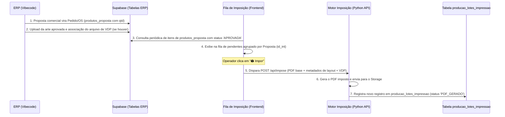
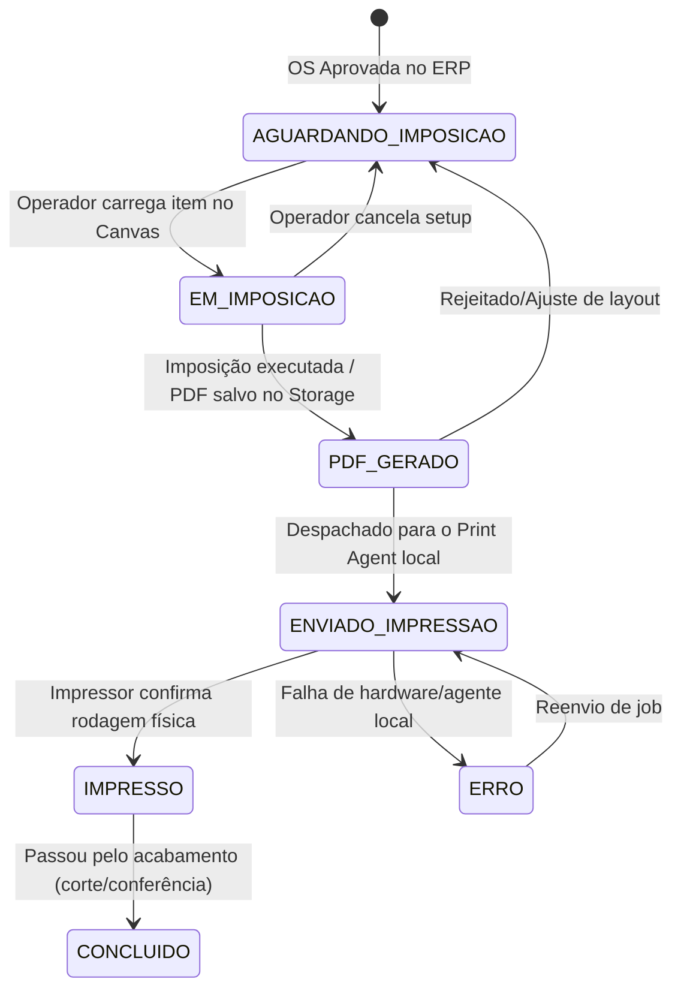
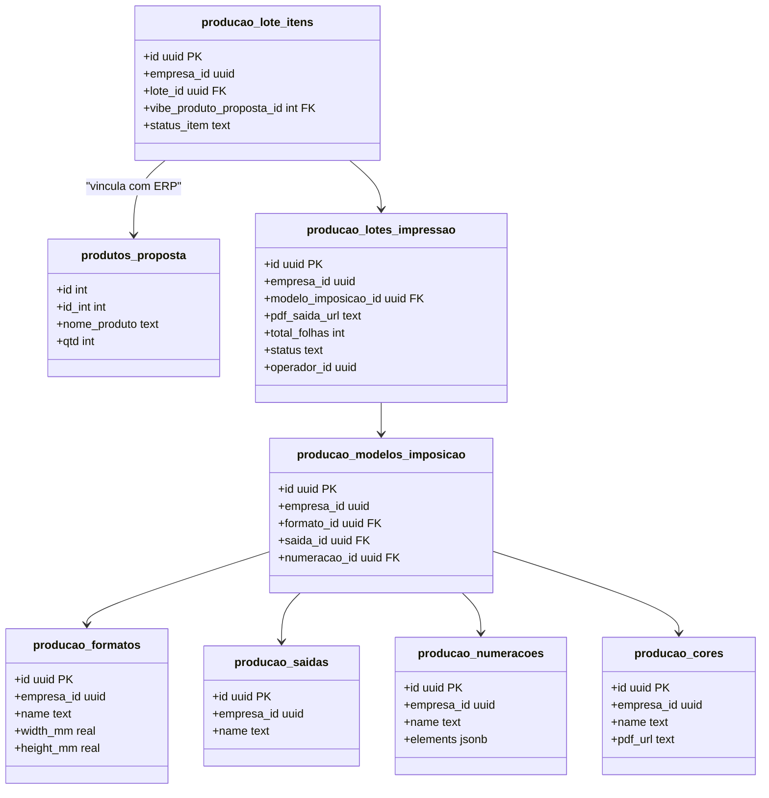

# Revisão Complementar: Arquitetura Operacional e Políticas de Segurança (RLS)
## Módulo de Imposição Gráfica & VDP

Este documento apresenta a revisão complementar de arquitetura operacional e segurança exigida para a homologação e aprovação conceitual do módulo de imposição no Supabase de Produção, respondendo às ressalvas apontadas e em conformidade com as regras de **UUID como PK** e **empresa_id**.

---

### 1. Entidade Operacional Principal: `producao_lotes_impressao`

Para representar a execução real (runtime) do motor de imposição, a entidade operacional principal será chamada de **`producao_lotes_impressao`**. 

Um **Lote de Impressão** representa a materialização física de uma ou mais ordens na folha de papel de saída. Cada vez que o operador executa a imposição e gera o PDF final, um novo lote é registrado.

#### Estrutura da Entidade `producao_lotes_impressao`:
*   `id` (UUID PK): Identificador único do lote (gerado via `gen_random_uuid()`).
*   `empresa_id` (UUID): Tenant ID para separação multi-empresa.
*   `modelo_imposicao_id` (UUID FK → `producao_modelos_imposicao`): Receita de configuração usada para a imposição.
*   `pdf_saida_url` (TEXT): Link do arquivo PDF gerado e armazenado no Storage.
*   `total_folhas` (INTEGER): Quantidade de folhas físicas a serem impressas (calculado pelo motor).
*   `quantidade_total_itens` (INTEGER): Soma de todas as poses personalizadas no lote.
*   `status` (TEXT): Estado do lote no fluxo produtivo (ver seção 3).
*   `operador_id` (UUID FK → `producao_usuarios`): Usuário que realizou a imposição.
*   `created_at` (TIMESTAMPTZ): Data/hora de geração.
*   `updated_at` (TIMESTAMPTZ): Data/hora de última alteração de status.

---

### 2. Entrada de Propostas/Produtos no Fluxo de Imposição

O acoplamento entre o ERP e o Imposition ocorre na transição do fechamento comercial para a pré-impressão:

---

### 3. Rastreamento e Status (Máquina de Estados)

O rastreamento de cada item de produto/OS dentro do fluxo operacional do Imposition será controlado rigorosamente por meio de uma máquina de estados na tabela de junção `producao_lote_itens`.

*   **Rastreabilidade:** Cada transição escreve automaticamente um log na tabela `producao_os_log` para auditoria, registrando o carimbo de data, operador e o status anterior/atual.

---

### 4. Modelo Conceitual da Execução Operacional (UUID e empresa_id)

A arquitetura separa claramente o **Catálogo de Configuração** (gabaritos estáticos) da **Execução em Tempo de Execução** (runtime/lotes operacionais) utilizando o tipo `UUID` em todas as conexões relacionais:

*   **Suporte a Multi-Artes:** A tabela de junção `producao_lote_itens` permite que um único Lote de Impressão (`producao_lotes_impressao`) contenha múltiplos itens de propostas diferentes (`produtos_proposta`), otimizando o aproveitamento do papel de saída (ex: agrupar 3 pedidos de pulseiras vermelhas de clientes diferentes na mesma folha SRA3).

---

### 5. Políticas RLS Planejadas (Segurança Supabase)

Para proteger a integridade dos dados compartilhados, o RLS será ativado por padrão em todas as tabelas `producao_*`. As políticas são baseadas na role JWT e no `empresa_id`:

#### A. Tabelas de Catálogo/Configuração
(`producao_formatos`, `producao_saidas`, `producao_cores`, `producao_numeracoes`, `producao_modelos_imposicao`)
*   **`SELECT`**: Permitido para qualquer usuário autenticado que pertença à respectiva empresa.
    *   *Regra SQL:* `CREATE POLICY select_catalogo ON producao_formatos FOR SELECT TO authenticated USING (empresa_id = auth.jwt() ->> 'empresa_id');`
*   **`INSERT / UPDATE / DELETE`**: Restrito a administradores e gerentes da mesma empresa.
    *   *Regra SQL:* `CREATE POLICY write_catalogo ON producao_formatos FOR ALL TO authenticated USING (empresa_id = auth.jwt() ->> 'empresa_id' AND auth.jwt() ->> 'role' IN ('admin', 'gerente'));`

#### B. Tabelas Operacionais/Execução
(`producao_lotes_impressao`, `producao_lote_itens`)
*   **`SELECT`**: Permitido para qualquer usuário autenticado da empresa.
*   **`INSERT / UPDATE`**: Permitido para qualquer operador ativo da pré-impressão/produção.
    *   *Regra SQL:* `CREATE POLICY write_operacional ON producao_lotes_impressao FOR INSERT OR UPDATE TO authenticated USING (empresa_id = auth.jwt() ->> 'empresa_id' AND auth.jwt() ->> 'role' IN ('admin', 'gerente', 'operador'));`
*   **`DELETE`**: Bloqueado por completo (Apenas soft delete via alteração de status para `CANCELADO` ou `INATIVO`).

#### C. Tabela de Logs e Auditoria
(`producao_os_log`)
*   **`SELECT`**: Restrito a gerentes e administradores da empresa.
*   **`INSERT`**: Permitido (escrita automática pelo sistema pós-ações).
*   **`UPDATE / DELETE`**: Bloqueado para todos (garante que os logs de auditoria nunca sejam apagados ou modificados).
